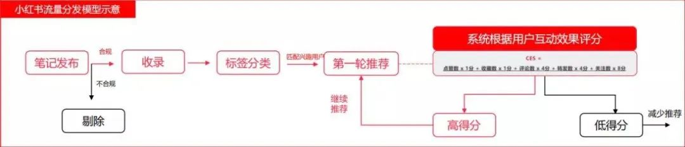
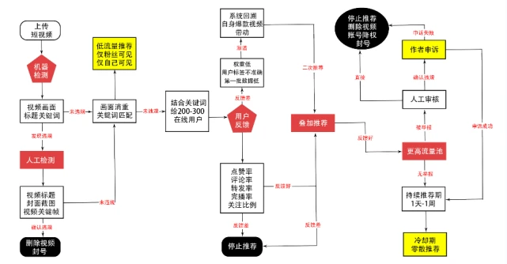
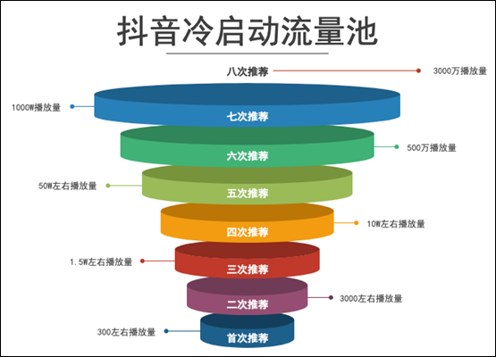
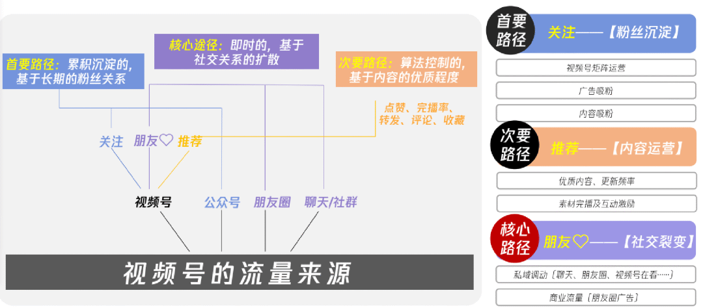

目前我国网民规模已超过10亿，在这互联网时代，更是流量为王。各个平台里的每个视频、每张图片，背后都有着算法的身影，支配着所有人的流量。

作为内容创作者及运营者来说，除了制作高质量的内容以外，也需要掌握平台的机制和算法规则，才能更高效地获取流量。

今天就来给大家分享一下三大主流平台**抖音、小红书和视频号的流量算法底层逻辑和优化建议。**想提高自己的流量，建议认真看完，最好收藏。

**小红书**

小红书的流量来源是什么？主要有四个部分：关注页、发现页、搜索页和本地页。其中，**发现页和搜索页是两个最主要的流量入口**，重点说下这两个入口的算法机制。

**1、发现页算法逻辑**

发现页是大部分人笔记的主要流量来源，正常来说笔记都会有基础的流量池，如果你的笔记有较好的数据就会被推送到下一个更大的流量池中，以此类推。

那如何获得更大的曝光呢？这里涉及到另外一种模型算法机制CES。

**CES评分标准：**CES评分=点赞数×1分+收藏数×1分+评论数×4分+转发数×4分+关注数×8分

笔记发布后，小红书根据学习模型对笔记质量进行打分，根据分数决定笔记初始排名和是否继续给笔记推送流量。

所以我们要做的是想办法**引导粉丝做好关注、转发、评分、收藏、点赞这几个互动动作。**只有一直有互动的动作，笔记就可能获得长久的流量，甚至发布几个月、一年后能还有流量推荐。

**2、搜索页算法逻辑**

发现页之外，搜索页也是一个较大的流量入口。小红书官方也公布，**有 30% 的小红书用户进入 APP 后会直接开始搜索。**

在搜索页，小红书则是按照排序逻辑分配流量，排序越靠上的笔记，获得的曝光量也就越大。但这个排序并不是固定的，笔记的排序也在随着算法的实时演算而不断变化。

主要有两点影响因素：

1）关键词的匹配程度：内容和标题与搜索词越接近和匹配，排名就会相对越高；

2）短时间的互动量：笔记在发布后的短时内获得较多的互动量，在搜索结果页中也会排名较前。

结合以上的流量逻辑，对于运营者来说要如何提升曝光？

**第一，做好内容。**没有好的内容做太多都是无用功，重要的是能为用户提供价值。要么是使用价值，要么是情绪价值。

**第二，做好互动。**无论对于哪种流量算法来说，互动始终都是十分重要的。运营者需要在笔记内容上思考如何引导互动以及评论区的互动。

**第三，深耕细分，做好关键词布局。**账号做的越垂直和细分，获得曝光和推荐的可能性就越高。可以多留意近期相关领域内的热词，在标题、内容以及标签标题中做好露出。

**抖音**

抖音是流量最大，也是算法最为复杂的平台。但根本原则一直保持不变：**去中心化的分发机制，让优质内容有最大的曝光机会。**

推荐的算法也是典型的“标签”对“标签”的平台。

无论是用户还是创作者，自身都会不断形成“标签”。创作者发布视频后，视频会根据创作者标签匹配相似的用户标签，然后通过该视频的数据表现来衡量该视频是否值得进一步的推荐。

图源来自网络

视频刚发布并通过审核后，系统将会分配给你一个初始流量池：200-500在线用户。**抖音会根据曝光所产出的数据，结合你账号分值来分析，是否给你加权。**

网上有一个广为流传的抖音冷启动流量池推荐的机制，分成8次分级推荐，如下图所示：

图源来自网络

如何能一步步突破流量池，主要有5个关键数据可供参考：

**1）完播率**

完播率越高，说明作品越吸引人观看，大盘的合格率在15%-20%左右，50%以上的完播率就已经很优秀了。

为了提高完播率，常见的方法是在视频开头设置悬念或引导观众参与评论，以延长观看时间，建议前期视频时长不要太长。

**2）点赞率**

点赞量越高，推荐量才会越高，第一波推荐的点赞率至少要达到3%-5%。也就是说每100个播放量，至少要有3-5个点赞。

**3）留言率**

可以确定的是留言率的表现越好，视频的加权推荐就越高。为了提升留言率，可以在视频中、文案或评论区主动引导观众发表评论。

**4）转发率**

转发率对于还在初级流量池流传的视频影响并不大，但想要突破流量层级，转发率就是很关键的指标。

**5）转粉率**

也就是路转粉的比例，单条视频带来的新增粉丝率，同样是冲击高级流量池的关键数据。

如果你的视频一直卡在 500的播放量上不去，就要及时做出改变。几点建议：

> 第一，做好账号定位。定位越垂直，标签才准确，视频的数据才能最大化；
>
> 第二，最好对标。前期可以多从别人那里汲取经验，模仿学习，少走弯路；
>
> 第三，提升互动。流量不高的情况下，尽量减少视频时长，完播率最为关键，多引导用户点赞评论及转发。

**视频号**

视频号与抖音、快手最大的区别在于分发和推荐模式。

在抖音上，只要你有优质的内容，无论你的账号粉丝数量如何，之前作品的播放量如何，只要内容受到平台用户的认可，就能够迅速走红。

然而，在视频号中情况截然不同。以数据量化的方式来看，在抖音中，内容占据了90%的重要性，而在视频号中，这个比例甚至可能不到50%。

换句话说，在视频号中，内容并不一定是王者。**视频号的本质是私域流量撬动公域流量。**

图源来自网络

目前视频号的算法推荐主要有两种，第一种是私域流量推荐，第二种是兴趣算法推荐。

**1、私域流量推荐**

私域流量推荐是指用户点赞和互动，这些用户的微信好友有可能会看到你的内容。然后，通过一轮又一轮的互动，可能会触发系统的推荐。

系统会判断你的内容是否优质，并将其推荐给更多用户。用户点赞后，他们的朋友也有可能看到你的内容，从而引发社交推荐。

基于这种算法逻辑，创作者需要自己引发第一波社交推荐。如果没有初始的播放和互动，即使内容质量很高，也很难被系统发现。

因此，一旦内容制作完成后，**首先要分享给好友、微信群和朋友圈，启动第一波播放和点赞互动。**

**2、兴趣算法推荐**

个性化推荐系统会根据用户的日常行为、活动轨迹和兴趣、职业、年龄等标签，通过一系列大数据算法，推测出用户可能喜欢的内容。

逻辑类似于抖音的“标签”对“标签”。创作者需要多添加话题和定位，有助于个性化推荐。

另外几个重要指标也是决定能否获得大量曝光的基础，关键指标衡量排序为：**完播率＞点赞数＞评论数＞点击扩展链接数＞转发数＞收藏数。**

因此，在没有建立起流量基础的情况下，初期的内容应尽量控制在一分钟以内，以确保高的完播率。保持频繁更新和提升内容质量是获得官方推荐的关键。

**写在最后**

以上就是关于三个平台的算法解析和建议。其实理解和掌握算法逻辑，只是做好基础，真正重要的还是内容。

正所谓**三分靠运营，七分靠内容。**持续不断生产优质内容才是关键，而精细和科学的运营可以实现内容价值的最大化。

> 引用：[三大主流平台(抖音、小红书和视频号)的流量算法底层逻辑拆解](https://www.135editor.com/essences/9370.html)
