### AIGC研究范畴界定

**AIGC是内容生产方式的进阶，实现内容和资产的再创造**

AIGC（AI-Generated Content）本质上是一种内容生产方式，即人工智能自动生产内容，是基于深度学习技术，输入数据后由人工智能通过寻找规律并适当泛化从而生成内容的一种方式。过往的内容创作生态主要经历了PGC、UGC到AIUGC的几个阶段，但始终难以平衡创作效率、创作成本及内容质量三者之间的关系，而AIGC可以实现专业创作者和个体自由地发挥创意，降低内容生产的门槛，带来大量内容供给。此外，对于仍处于摸索阶段的元宇宙世界，AIGC技术的发展也带来了解决元宇宙内容创造问题的解决可能，可实现为元宇宙世界构建基石的关键作用。

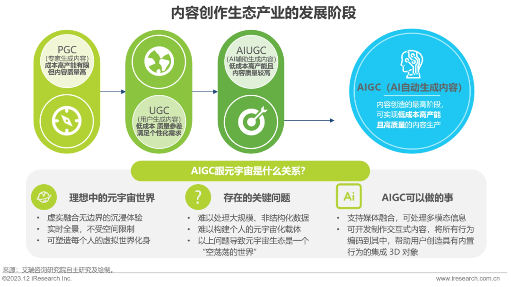

### AI&AIGC的演进历程

**从决策判别到创造生成，人工智能进入双“G”时代**

AI的发展经历了从决策式AI到生成式AI的过程。在2010年之前，AI以决策式AI为主导，决策式AI学习数据中的条件概率分布，底层逻辑是AI提取样本特征信息，与数据库中的特征数据进行匹配，最后对样本进行归类，主要针对对样本的识别和分析。2011年之后随着深度机器学习算法以及大规模预训练模型的出现，AI开始迈入生成式AI时代，生成式AI的特征是可以根据已有的数据进行总结归纳，自动生成新的内容，在决策式AI决策、感知能力的基础上开始具备学习、执行、社会协作等方面的能力。当下人工智能在生成（Generation)和通用(General)两条主线上不断发展。

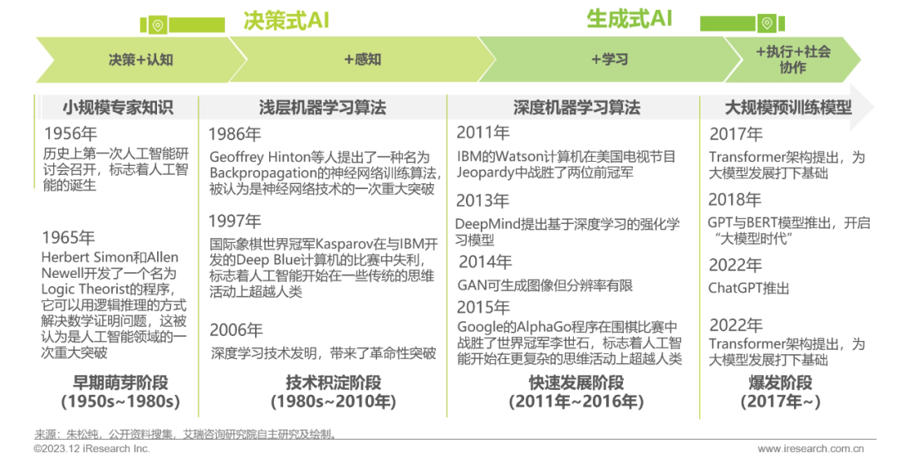

### 为何ChatGPT被称为AI的“iPhone”时刻？

**代表了大模型时代的爆发，使得AI的可用性与易用性大幅提升**

ChatGPT达到1亿用户只用了2个月，与之对应，即便是Apple APP store也花费了2年时间才达到1亿用户，人工智能正以摧枯拉朽的势头席卷整个科技圈，英伟达CEO黄仁勋更是喊出ChatGPT就是AI的“iPhone时刻”。

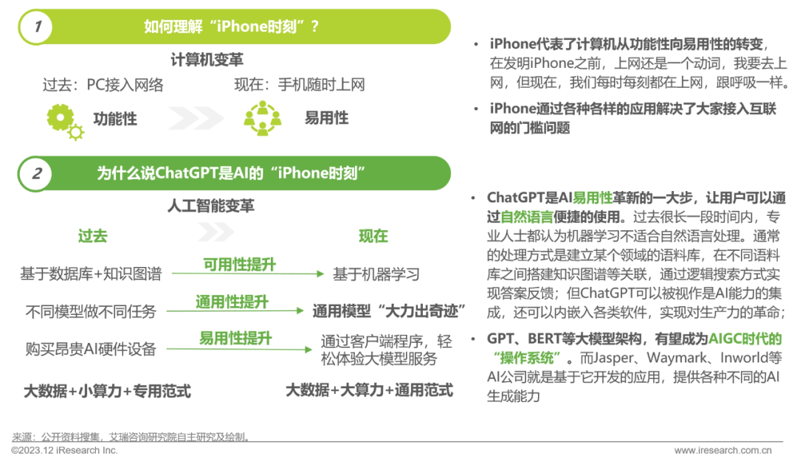

### 从ChatGPT的爆火看AIGC的技术发展

**Transformer类架构的发展带动多模态融合，为范式转变奠定基础**

在图像生成领域内，CNN类架构是一个重要的里程碑，尤其擅长图像分类和目标检测任务，但由于难以生成高分辨率任务、难以捕捉图像全局结构和语义信息。近年来，Transformer类架构在图像生成领域也开始逐渐被应用，在自然语言处理领域的机器翻译任务中，Transformer已经成为了一种主流的模型架构。在图像生成领域，Transformer类架构可以有效地捕捉图像的全局结构和语义信息，同时也可以生成高分辨率、逼真的图像，多模态架构逐渐成为了图像生成领域的研究热点。多模态架构可以建立统一的、跨场景/任务的模型，将不同类型的数据（如图像、文本、音频等）融合起来，极大地拓展了人工智能认知并理解世界的能力边界。多模态学习在不同模态间搭建了桥梁，使得基础模型通过迁移学习和规模涌现达到能力跃迁成为可能，极大加速了通用模型的演进。

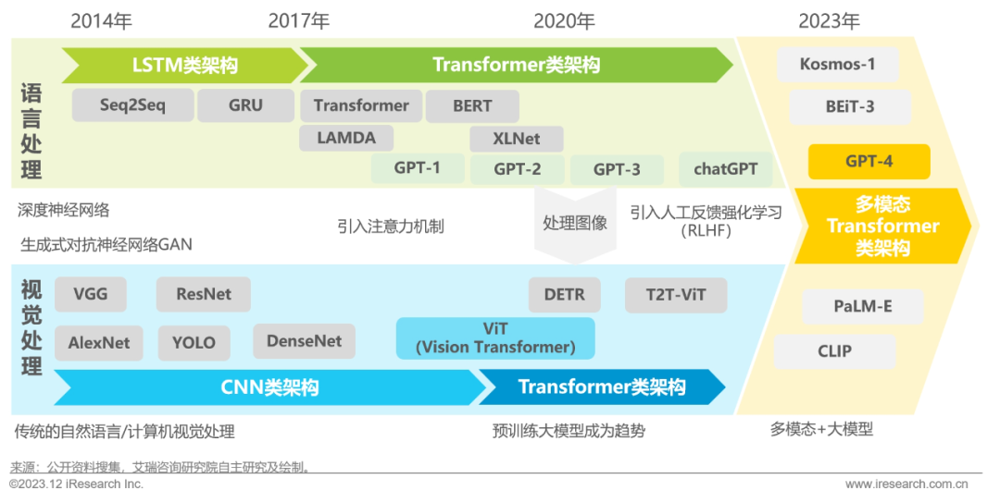

### “成熟”的AIGC大模型需要哪些要素？ 

**大模型是一场综合战斗，需要兼顾技术、人力和资本要素**

AIGC产业的发展是对于技术条件、人才条件和资本条件的综合试炼场，其中技术条件无疑是核心的核心。AIGC技术主要由算法、算力和数据构成，三者互为因果。

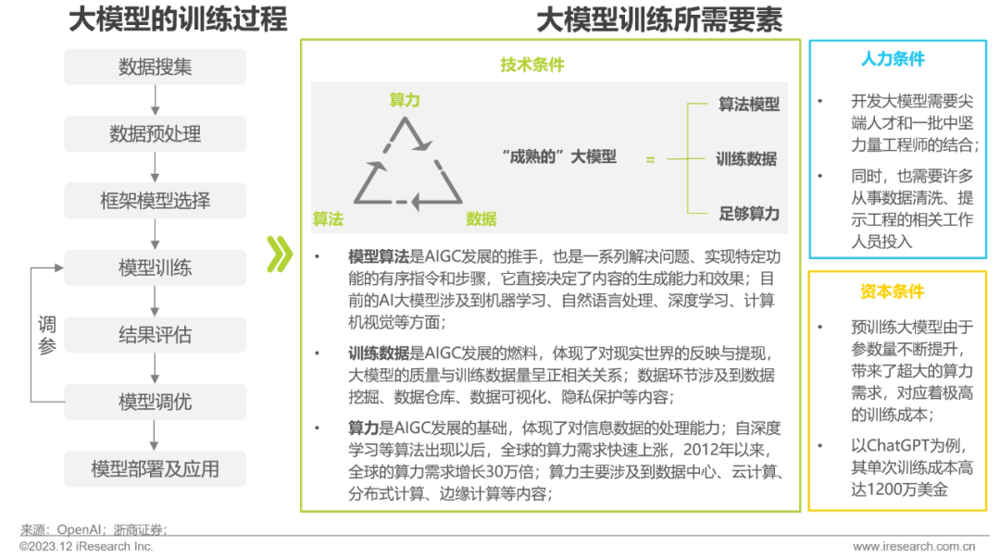

### 通用基础的AIGC大模型发展重点

**技术能力是大模型发展基石，算力、算法和数据三者互为推手**

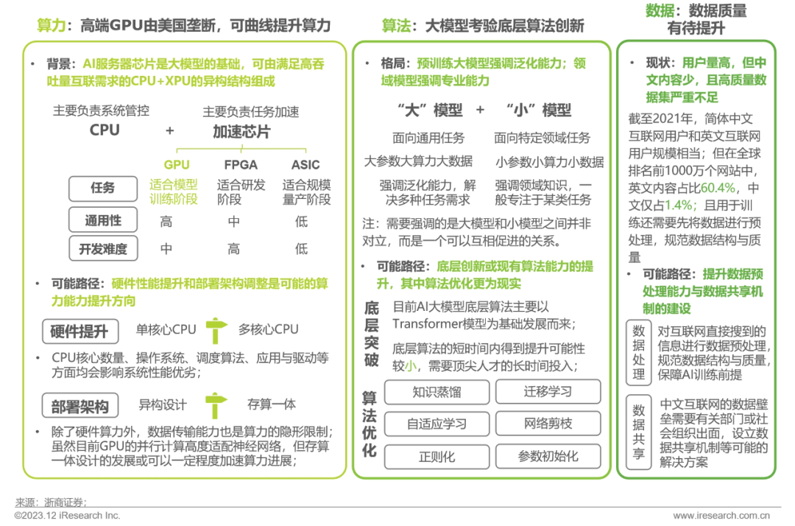

### AIGC产业链路

**AIGC产业可分为三层，其中模型层和应用层值得关注**

AIGC现有产业链由数据供给、模型开发与定制、应用与分发构成。目前来看，模型层为关键因素之一；其次，应用层发展空间巨大。上游数据供给由收集大量原始数据对其进行预处理，以便提供给模型训练，投资确定性强。在中游，使用注释数据开发和训练AI模型以生成内容，在垂直细分领域进行二次开发，来适应定制化需求；下游协助用户使用模型和算法生成内容，例如：文本、图像、视频等。基于不同的价值创造逻辑，将生成的内容分发到各种渠道。

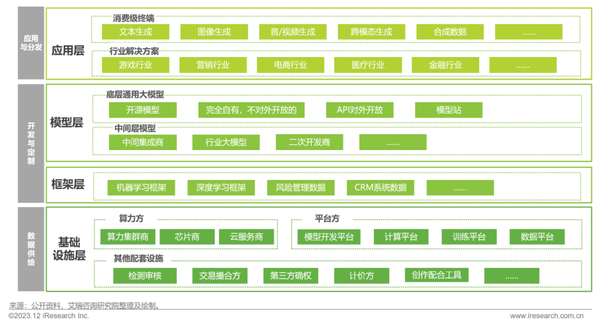

### 产业链中的模型层有望实现分化

**通用大模型一时风头无两，但未来多种模型组合是更可能方向**

我们认为，短周期内通用类大模型市场热度较高，长周期内多种模型组合是未来发展方向。根据模型体量，AIGC模型可分为大模型、小模型、微模型。大模型参数量大，算力强，具备通用类问题处理能力。小模型多专注于垂类领域，往往在垂直场景具备充足的数据以及问题处理能力。微模型更加个性化，由用户个人数据训练而成。大模型和小模型具备不同的优势，分别通过压缩技术以及教师模型进行整合来提高问题处理能力，能够实现1+1大于2的效果，可能是未来模型层的发展方向。

### 产业链中的应用层尤其值得关注

**应用层更像是移动互联网时代的工具，有望生长出巨大的价值**

我们认为，AI以基础设施层、框架及模型层、应用层为主要的领域，分别对于产业链的上游、中游、下游。基础设施层的核心是提供算力，包含CPU、GPU等服务器设施。模型层以AI模型产品为主，投入周期较长，存在一定的技术壁垒。应用层是AI产业链的下游，直接对接客户以及用户，主要包含面向C端的消费级终端以及面向B端的行业解决方案，应用层本身进入壁垒较低，同时中国具备广阔的AI应用层落地场景，因此我们认为应用层存在较多机会。

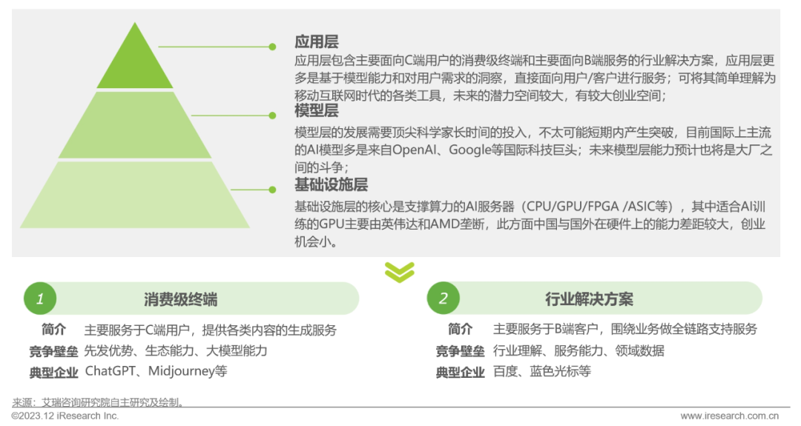

### 未来中国的AIGC产业将走向何方（1/3）

**大模型多模态：进一步深化，其中文生视频能力将进一步提升**

在目前的市场下，AI已经具备生成文本、音频、图像、视频的能力。基础的生成式AI以文本模态为主要特征，音频、图像、视频等模态市场热度较高。文生图像以CLIP为主要训练的神经网络模型，其中文本和图像通过编码器进行分解，分解后进行映射，完成训练，文生音频具备相似的训练模式。随着大模型多模态能力升级，文生视频快速发展。继文生图能力融入各个大模型之后，文生视频成为大模型多模态应用的新趋势。近期多家厂商发布相关产品或更新，大幅提升文生视频效果。

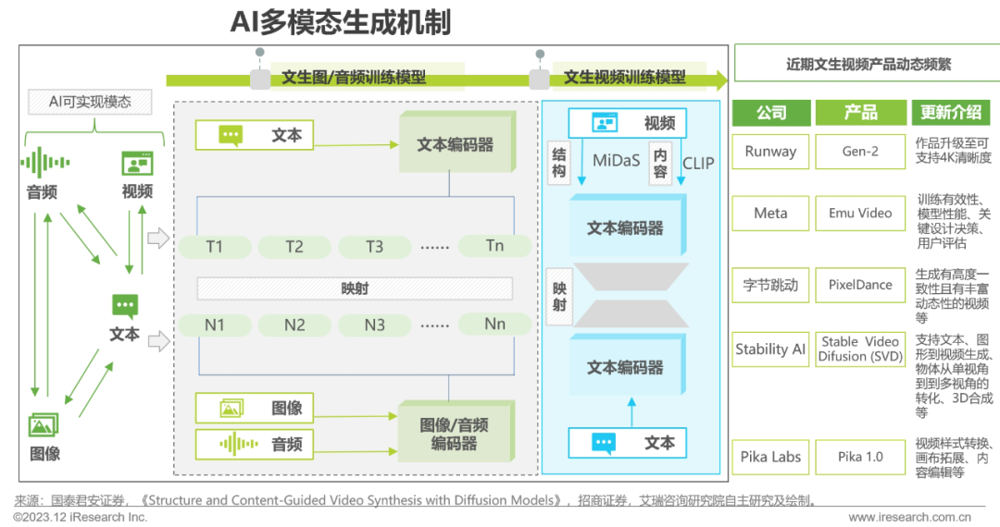

### 未来中国的AIGC产业将走向何方（2/3）

**应用层：进入壁垒较低具备更加广阔的创业空间，对中小企业的容纳性高**

模型层以高研发壁垒以及高运行成本为主要特点，一方面从数据基础和训练成本来看，模型层的研发均需要体量较大的数据以及充足的算力来完成，另一方面从运行成本来看，模型层的运行需要较强算力的支持。应用层本身目前的运维成本较低，同时适合对底层算法能力有着不同期望的企业。大厂存在数据和资金两方面的基础，在模型层具备优势。应用层目前受惠于行业普遍较低的模型API调用价格，运行成本目前还较低，适合初创企业。

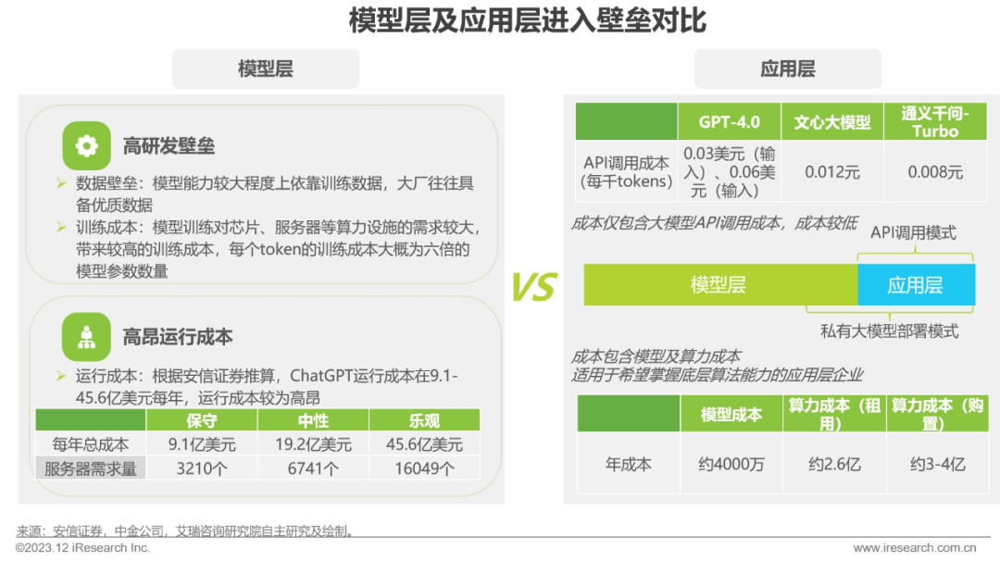

### 未来中国的AIGC产业将走向何方（3/3）

**大模型应用能力：能力提升带来AI Agent，帮助AI智能化** 

随着大模型技术的成熟，规模增大，大模型为AI Agent提供强大能力。Agent+大模型将有望构建具备自主思考、决策和执行能力的智能体，进一步提升大模型的应用能力。在人工智能领域，AI Agent视为能够使用传感器感知周围环境、做出决策并使用执行器做出响应的人工实体。对比AI与人类的交互模式，AI Agent 较目前广泛使用的Copilot模式更加的独立，能够自主调用资源完成任务，人类在其中起到督促和评估的作用。AI Agent具有更广泛的应用范围可处理多个任务，并在不同领域中执行各种功能；具有更自然和灵活的交互方式，能够理解复杂的自然语言指令，与用户进行更智能对话。

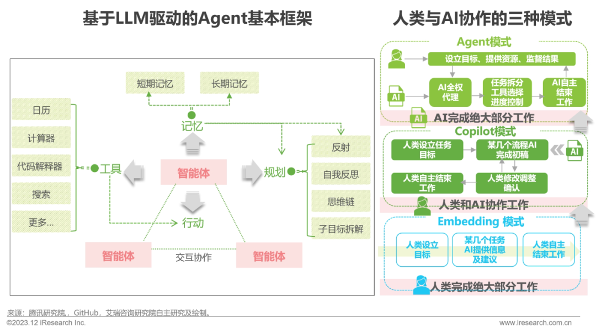

### AIGC产业融资概览

**AIGC在全球范围内迎来融资热潮，国内多行业企业备受投资机构关注**

从全球的视域来看，全球AI产业在22年经历了微小的回落之后，23年迎来强劲反弹，仅上半年生成式AI在资本市场便募集约141亿美元的资金，产业在资本市场异常火爆，同时大部分的企业仍处在早期融资轮次，后期仍存在大量的资金需求。从中国的视域来看，中国AIGC产业呈现相似的趋势，21年达到峰值，受疫情影响22年产业融资数额较低，随后在23年呈现反弹。AIGC本身对资金需求较大，随着AIGC在国内应用场景的逐步落地，我们预计24年AIGC在资本市场仍然是投资热点。

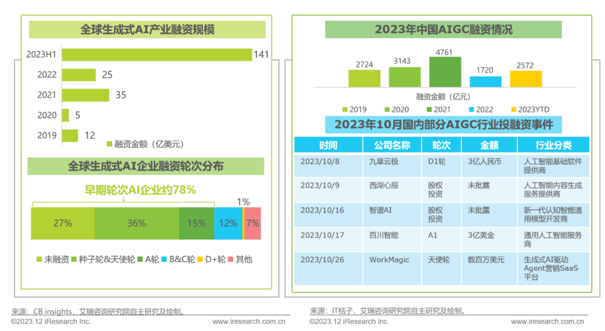

### AIGC场景应用图谱

**AIGC场景应用包含通用的消费级终端和针对各行业的解决方案服务商**

我国AIGC产业发展目前已经发展出了两类主要业态，其一是主要面向C端用户，提供的产品主要可以以模态划分为文本生成、图片生成、音频生成、视频生成、虚拟人生成等多样内容形态；其二是主要面向B端企业客户，提供的产品更多是基于特定领域的专业服务，目前布局较多的赛道包括游戏、媒体/影视、电商及广告营销等重内容赛道。未来相信AIGC将继续延展产业链，并在商业化场景上持续拓宽拓深，深入变革各个行业。

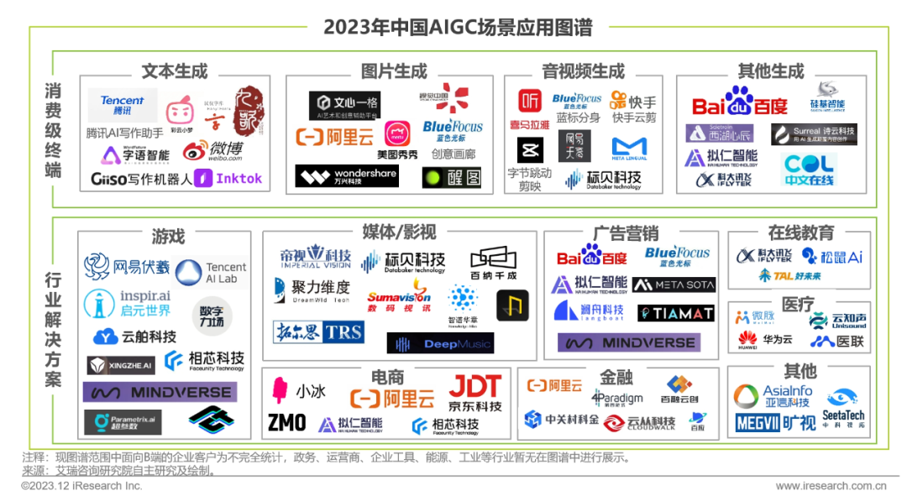

### AIGC实践及应用：行业应用变革分析

**以内容生产力、技术成熟度维度来评价行业是否会被AIGC颠覆**

该评价体系按照系统性和典型性原则，将通过从内容生产力、技术成熟度维度去评价AIGC对于各行业的影响程度。

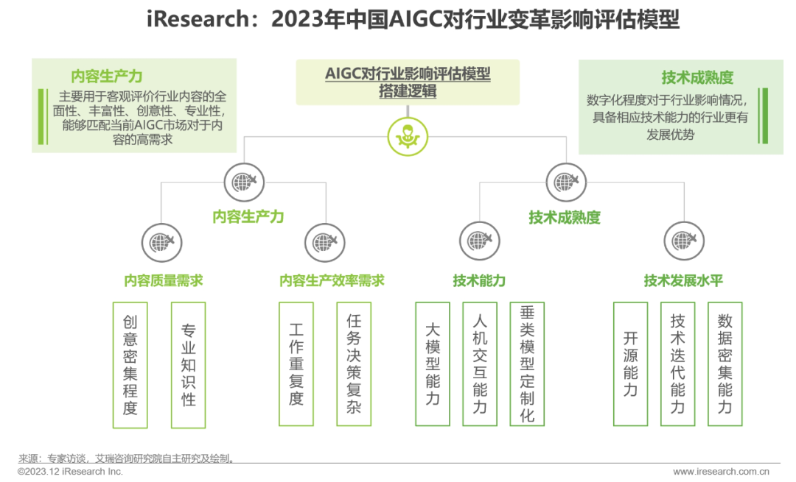

### AIGC实践及应用：行业应用变革分析

**各行业应用AIGC商业实践分析**

在“iResearch：2023年中国AIGC对行业变革影响评估模型”的研究基础上，我们聚焦“AIGC在行业可变革程度、行业商业变现潜力两个维度进行解读。

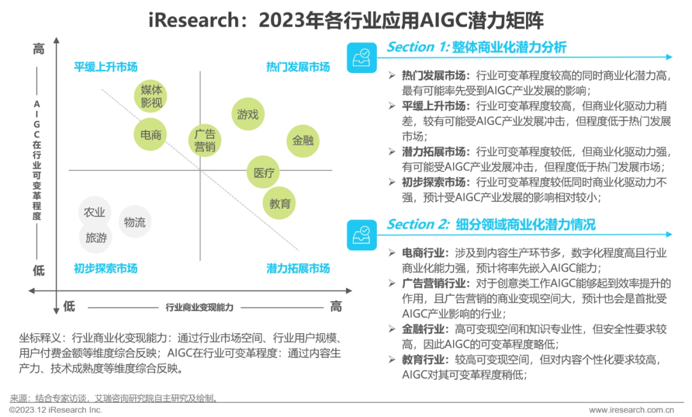

### AIGC实践及应用：游戏行业

**AI助力内容生成效率及效果提升，赋能游戏开发全流程**

游戏行业具备高交互性、内容创意密集等特点，是最容易受益于AIGC影响的领域之一。在游戏行业，AIGC的应用越来越广泛，它不仅可以帮助游戏开发者降低成本、改善效益、打造创新玩法等，还能为玩家提供更加丰富、逼真的游戏体验。在国内，已有越来越多的游戏厂商将AIGC技术接入工作流。游戏行业本身对内容需求较高，一方面，游戏行业要求更加多样的内容形式，包括画面、语音、人物对话、剧情故事等。另一方面，游戏行业需要较高质量的内容以实现高交互性，这也使得游戏行业在前AI时代在策划、美术、配音等内容环节具备极高的成本，而 AIGC技术的出现为游戏内容生产带来了新可能。

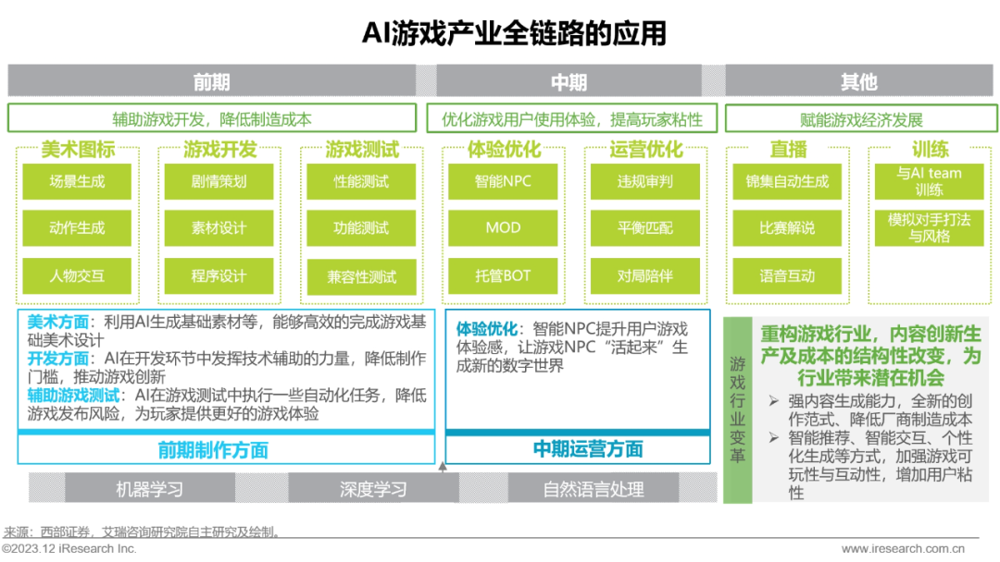

### AIGC实践及应用：广告营销行业

**全链赋能多维增效，提供精准、创新、前瞻性的解决方案**

营销环节目前仍然是AIGC应用最多的业务场景之一，AIGC在营销行业从初期的市场分析、中期的客户转化以及后期的客户复购均可参与打开营销生态新思路，为消费者提供更个性化、智能化和互动性强的营销体验。AIGC技术的应用给广告行业带来直观地好处，大幅降低内容生产制作成本，从理解语义进化到了对语义的分析归纳，实现了从无到有生成内容，加速创意落地。

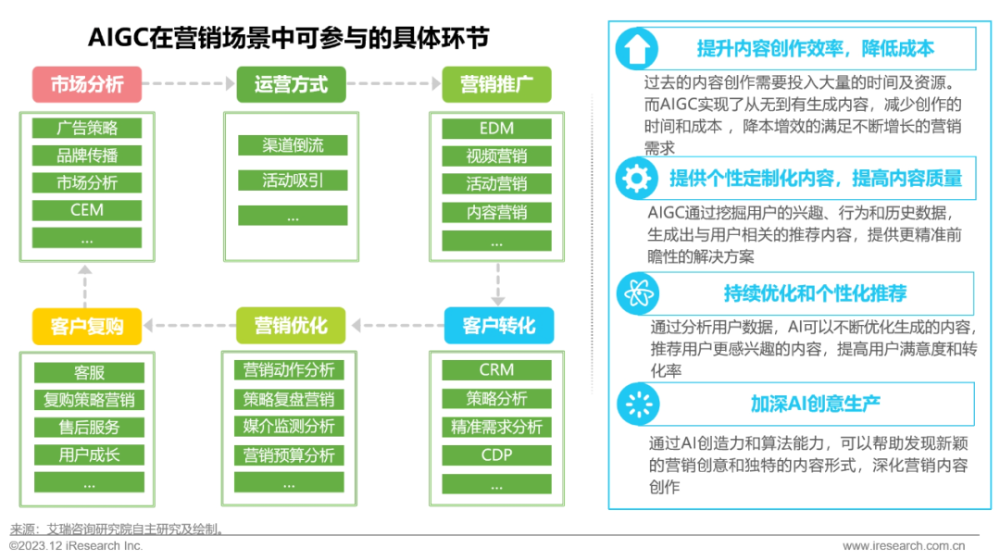

### AIGC实践及应用：媒体影视行业

**AI加速媒体行业智能化发展，塑造数字内容生产与交互新范式**

AIGC在媒体影视方面的应用贯穿前中后期的策划、制作、宣发等环节。AIGC的出现提升了生成内容的质量，前期策划应用中，剧本生成工具成为了可能，但尚处于初期目前仍只能完成辅助性工作。AIGC在中期制作环节中的应用已经较为成熟，通过AIGC可以生成虚拟画面，同时可以对影像进行自动剪辑、AI换脸等操作，对画面进行智能化的标注，为制作团队提供更加清晰和高效的素材管理方式。后期的宣发环节，AIGC能够生成各种高质量的宣传片，并通过多种渠道进行精准推广，并且进一步实现营销、经营分析等工作。

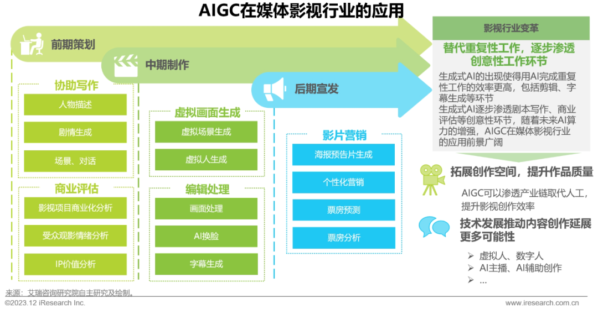

### AIGC实践及应用：电子商务行业

**大模型增效，AI+电商迎来新机遇**

AI能力在电商场景里的应用并非刚开始，但基于自然语言的交互，生成图片、视频等内容的大模型AI从商品销售、市场推广、经营分析等方向存在商业化应用，为电商行业注入新活力。在售前环节，通过AIGC强大的产品和市场分析能力可以进行商品的包装以及进行选品和定价。在推广环节，AIGC可以生成虚拟带货主播以及虚拟客服，同时使得针对具体受众的个性化推广成为可能。此外，AIGC可以对市场和消费者进行洞察，辅助人工决策。在web3.0时代，人工智能赋能电商行业迎来新的时代机遇。

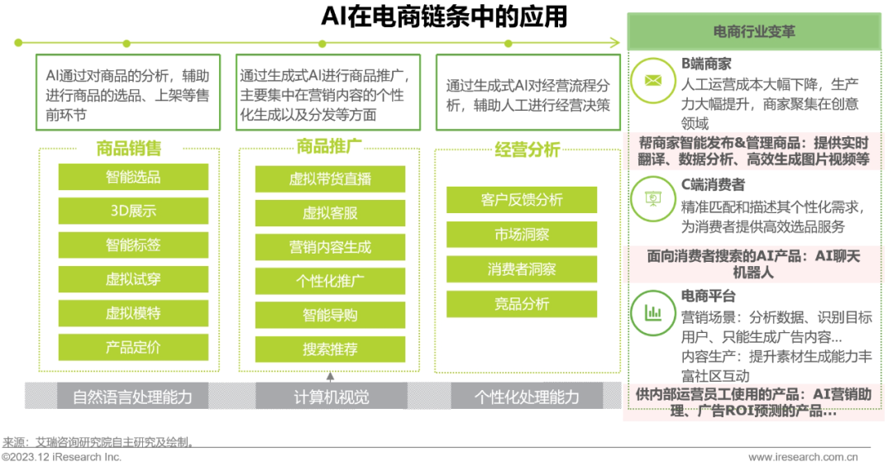

### AIGC实践及应用：医疗行业

**前景广阔，AIGC有效提升病理诊断效率、缩短药品研发周期**

AIGC在医疗行业的应用主要集中在诊断、药物研发、医疗数字化三个方向。医疗诊断方面，AIGC目前正处于辅助诊断的发展阶段，可参与到疾病筛查、医学影像分析、诊疗等工作当中，提升服务效率。在制药上AIGC主要在药品研发环节有所应用，药品研发涉及到药物的探索、设计、临床研究等环节，AIGC可进行靶点的发现、药物的生成筛选、临床受试者筛选等工作。此外，AIGC还可以通过强大的数据分析能力提高医疗数字化的程度。

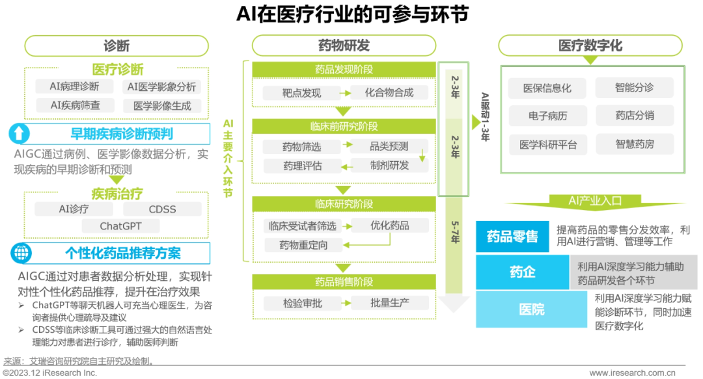

### AIGC实践及应用：金融行业

**前台营销及中台商业化程度高，复杂性投研工作发展潜力大**

AIGC在金融行业的应用存在前台、中台和后台的分野，基本涵盖金融行业前中后台中的市场营销、投研项目、产品设计、风控合规、客户服务、运营管理，并基于底层五大人工智能技术支撑来得以实现。在短期的前景来看，前台营销及中台部门应用较为广泛，前台营销部门利用AIGC智能撰写及推荐等，中台部门利用AIGC可打造风控中台、客服中台等，商业化产品已经较为成熟。前台投研存在较为复杂的建模、尽调等工作，但目前生成式AI产品主要为开源的大模型，商业化程度低，AIGC在短周期内仍主要承担辅助性工作。

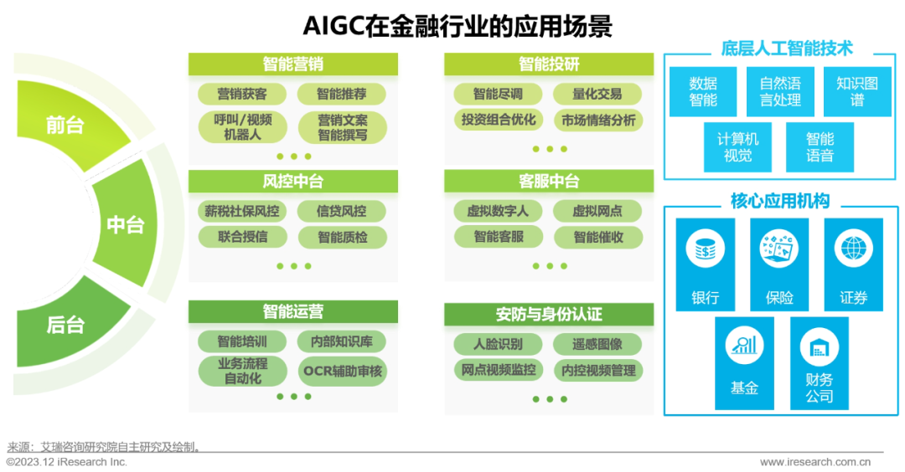

### AIGC浪潮下的机遇与挑战

**行业展望：关注技术创新、应用场景的拓展及产业生态丰富**

从现阶段的应用来看，AIGC工具本身仍存在着技术上的局限性，同时AIGC技术的真正落地目前在产业侧还存在着顾虑，落地仍存在风险。主要风险包括数据安全隐私问题、算法、技术成熟度等问题。需要各方共同努力，加强监管和规范，推动技术的进步和应用，以实现更加安全、可靠的发展。同时，AIGC作为人工智能领域的重要分支，未来行业展望前景好，技术创新和应用场景拓展将成为主要驱动力，跨界合作和法律法规的完善将为行业发展提供保障。

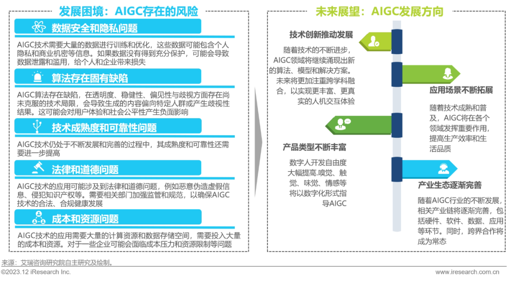

> 引用：[2023年AIGC场景应用展望研究报告](https://mp.weixin.qq.com/s/lLk2Ppw7YXtLTEgI2yXnuQ)
