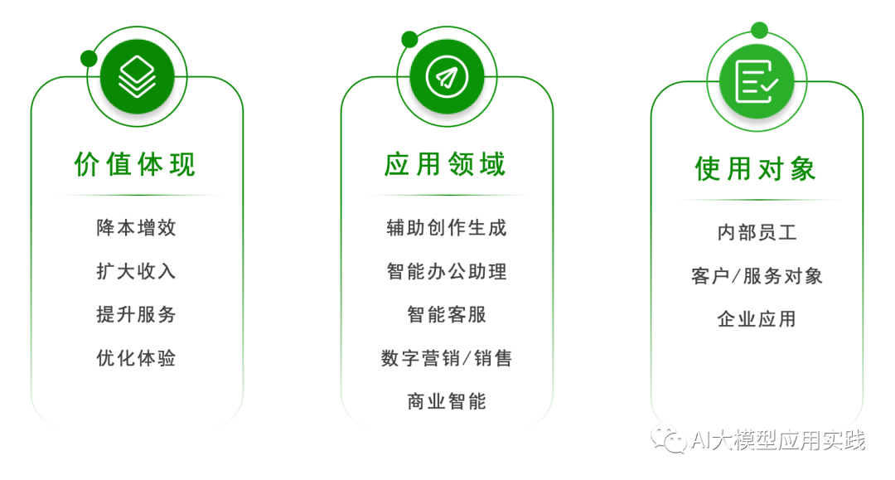
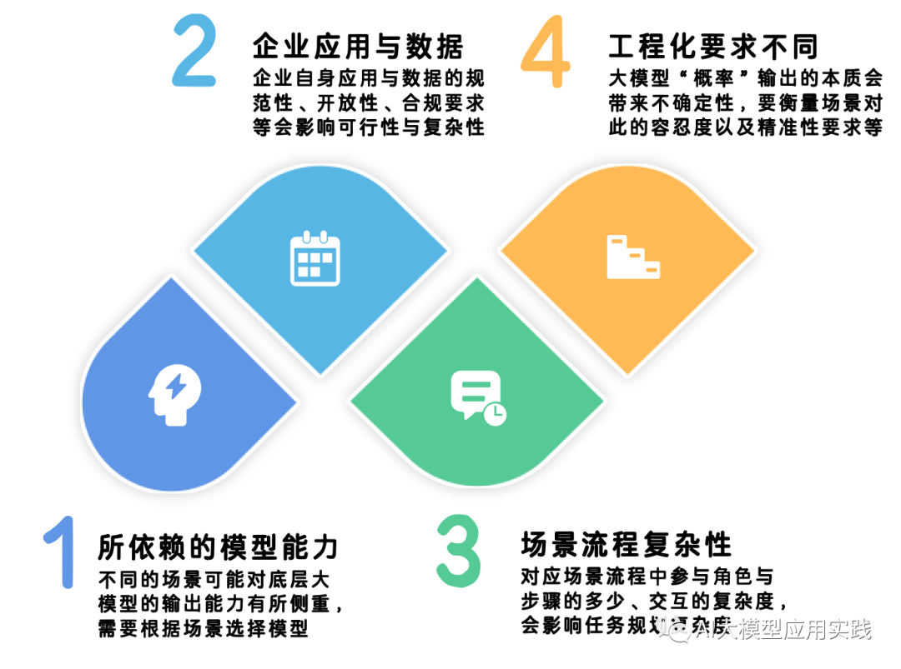
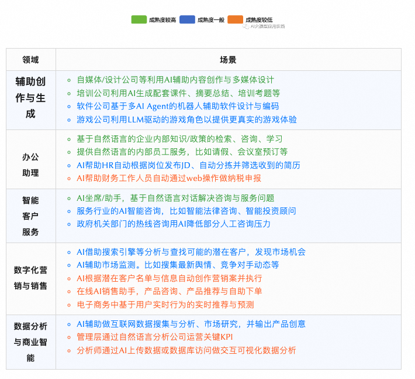

2023年，大模型与生成式人工智能（Gen AI）席卷全球。如果你一直关注大模型，那么你一定会注意到AI Agent已经成为下一个AI前沿领域，也被普遍认为是人工智能走向AGI（通用人工智能）的必经之路。在层出不穷的大模型加持下，AI Agent已经成为众多科技巨擎布局与发力的关键领域，比如领头羊企业OpenAI刚发布不久的GPTs Builder与Assistants API正是其在AI Agent领域的最新布局，也彰显了其在这个领域的信心与野心。

> 一些产品中会用AI Assistant即智能AI助手来代替AI Agent，其本质上是一致的。本文不会普及AI Agent的基础概念，有兴趣的可以阅读【[深入AI Agent：超越大模型的新焦点，从大模型到自主人工智能体](http://mp.weixin.qq.com/s?__biz=Mzk0MjUwMzY1MA==&mid=2247492564&idx=1&sn=d438adfa3738819493bb7ede131c61ab&chksm=c2c08059f5b7094f6bb9f944fae9bf23df04fdb6a03e29632a4fb178c5e3837558d049298f50&scene=21#wechat_redirect)】

尽管目前ToC领域的GPTs已经百花齐放，但暂时也没有出现颠覆式的杀手级应用以体现其潜在价值。而在2B领域，在互联网时代已经完成数字化转型的众多企业，也正在面临着新一轮的技术变革，即为生成式AI做好准备：**大模型将成为企业IT中的基础设施之一，并在一系列的业务场景中得以应用并发挥潜力；而具备自主的感知、规划与工具使用能力的AI Agent智能体或许有着更强大的应用价值。**

AI Agent对于企业应用的价值体现在哪里，更具体的说其在企业的应用场景在哪里？由于各个行业自身的业务特征、应用环境千差万别，很难简单罗列所有的应用场景。我们首先从**价值体现、应用领域、使用对象**三个不同角度去对AI Agent的企业应用场景做简单的分类：

接下来我们从这几个不同的角度看未来AI Agent在企业的落地。

**【价值体现】**

毫无疑问，从AI Agent在企业应用的价值体现上看，都应该是围绕**降本提效、改善服务、优化体验**这几个核心价值点，否则也就丧失了应用的意义，所以这本身没有太多可探讨的。在这个角度，最值得关注的也是最具有不确定性的或许是**如何科学衡量AI项目在企业落地与应用的真正价值与ROI**？特别是在目前阶段，由于不同技术与应用的成熟度仍在发展，存在差异；而不同组织的成本敏感度、人才储备、客观条件（比如知识管理与现有IT应用的成熟度）也千差万别，因此很难单一直接的去判断一个AI场景的价值。但是在当前的技术成熟度仍然处于上升与快速迭代的阶段，我们建议的最佳实践应该是：

**综合衡量并选择从应用价值明显、技术成熟度较高、工程实施简单、初期成本最可控的领域与场景开始，并保留系统架构上的扩展性，预留未来的演进空间。**

**【应用领域】**

这里从应用领域对AI Agent在企业的常见应用作简单的总结。由于各行各业有各自的领域特征，因此这里只是选择一些**目前有代表性、有原型或者实施案例**的场景用作介绍与参考。这些不同的AI Agent场景，由于以下几个方面的差异，会导致企业在落地该场景的AI项目时的成熟度与风险有区别：

- **所依赖的模型能力不同。比如：**

  基于私有知识的问答需要依赖于向量模型、语义检索。

  数据分析则需要依赖于大模型的代码生成、Text2SQL等能力。

  与企业应用集成的Agent需要依赖于模型自身规划与使用API/工具的能力。

  

- **对企业自身数据与应用的要求不同。比如：**

  基于私有知识的问答应用很大程度上要依赖企业自身知识管理的完备性。

  自动化业务流程的Agent则要求企业应用有完备的API接口体系。

  办公助理Agent需要企业的协同办公平台具有开放的接口或插件支持。

  

- **场景的业务流程复杂度不同。比如：**

  简单知识问答形态的Agent几乎不涉及很复杂的业务流程。

  一次销售/服务Agent的流程中则可能需要和CRM等应用作多次交互。

  市场研究与分析的Agent则可能需要借助外部平台来获取最新数据。

  

- **工程化要求（性能、准确性等）不同。比如：**

  在辅助创作与生成的场景中对大模型输出的容忍度相对更高。

  在数据分析场景中则要求模型输出结果具有最高的准确性。

  在应用集成时则要求模型能准确推理工具使用需求并提取输入参数。

  

基于这些差异性，我们对企业常见的Agent场景做总结，并简单区分其实施成熟度用作参考：

**【使用对象】**

与AI Agent在企业中产生直接交互的对象可以分成三类：

**一类是直接面向企业的外部客户等服务对象。**这类场景下，使用者通过自然语言与AI Agent对话，Agent完成任务给出响应。比如在线智能客服、在线咨询等。

**一类是直接面向公司内部使用者，包括普通员工、数据分析员、决策管理人员等。**同样，使用者通过自然语言UI与Agent协作交互并完成任务。比如内部办公助手、交互式数据分析等。

**还有一类特殊的Agent使用方式，是将Agent的能力嵌入与集成到其他应用之中。**在这类场景中，Agent不直接与“人”产生交互，而是由其他企业应用来触发，并借助Prompt完成自动化任务。比如：在CRM系统中发现一条新的销售线索后由Agent自动创作个性化的营销方案并推送；线上商店产生一条订单后由Agent自动审核并完成物流下单等后续流程。

**从使用对象角度看，为了尽量降低对企业生产的影响与风险，AI Agent应用的落地可以优先考虑从后两种类型的部分场景开始。**

>引用： [ToB才是真正的破局点？AI Agent智能体在企业落地与应用的场景及架构探讨](https://mp.weixin.qq.com/s?__biz=Mzk0MjUwMzY1MA==&amp;mid=2247501769&amp;idx=1&amp;sn=eacf889fc97628993a4f0b7aaf52ef78&amp;chksm=c2c0a444f5b72d527d4733fcc1ef32478de97614f0f600ac91f58ec68becc23d922700e365c6&amp;scene=21#wechat_redirect)
