我们把最终体现上层应用能力的AI Agent从不同的技术要求与原理上分成了几类：

- 创作与生成类助手

- 企业知识助手

- 数据分析助手

- 应用/工具助手

- Web操作助手

- 自定义流程助手

  

本篇将对这几类AI助手分别做进一步探讨。

### PART 01 创作与生成类助手

大模型是生成式AI的基础，因此，理解、创作与生成内容是其强项也是最基本的能力。在C端市场，大量的生成类AI工具已经遍地开花（包括图片、视频、音乐），也是目前最成熟的一种应用形式。需要注意的是，在C端工具中，我们也经常看到各种形式的简单“助手”：

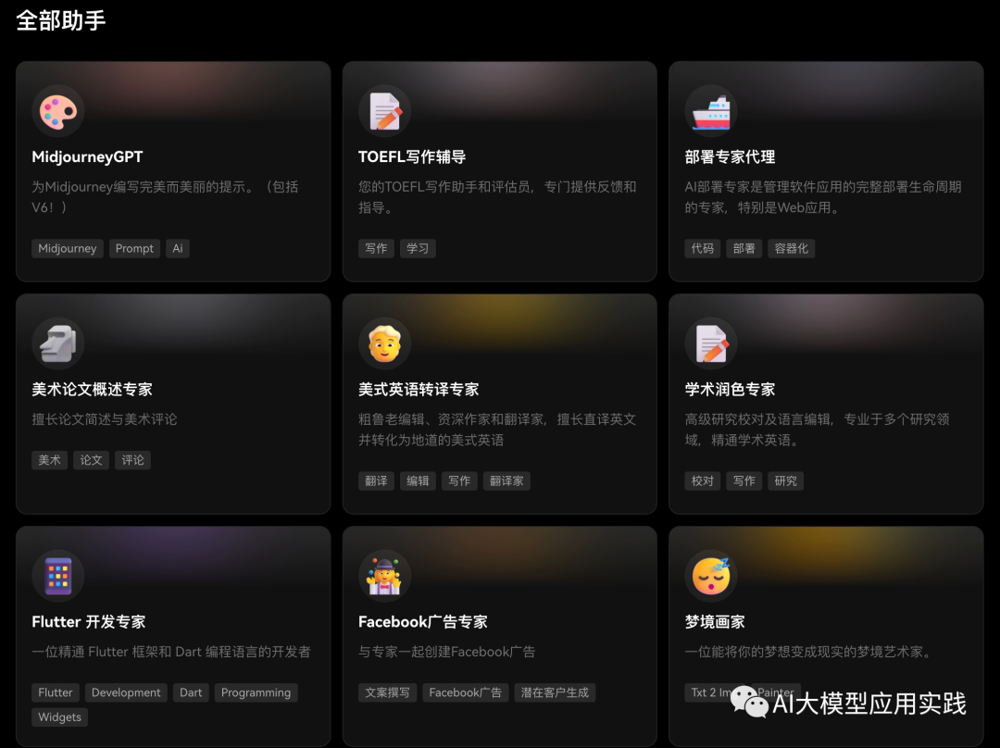

这里的助手与我们这里探讨的企业应用中的AI Agent有一定的区别：

> **AI Agent是一个以任务驱动的具备自主能力的智能体，不仅需要大模型这个核心“大脑”，也需要任务规划、记忆与外部工具使用等能力。而我们常看到的个人AI助手大部分是基于预设提示词的大模型问答Bot，在不借助其他插件时，通常不具备工具使用能力。**

当前在企业应用中以内容创作生成为主要能力的AI Agent从技术上至少有两种：

1、**单Agent的内容生成**。简单地将大模型的生成能力通过API集成到其他应用与业务流程中，替代或简化原来由人工完成的部分工作。比如：

- 在线培训管理系统中，利用AI自动根据课件创建考题/考卷

- 在数字营销流程中，利用AI生成精确营销话术甚至撰写营销方案

- 市场分析的AI Agent基于互联网搜索或开放数据生成市场分析报告

- 电子商务企业借助AI自动批量生成商品摘要

- 媒体行业通过AI生成新闻摘要；学术平台借助AI生成论文摘要

  

这种类型的AI助手简单的借助Prompt工程即可实现（与C端个人助手并无本质区别）：

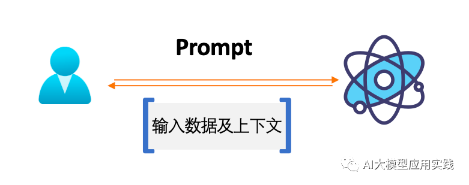

2、**基于多Agent协作（可能还有人类）的内容生成**。典型的为虚拟机器人软件公司，由AI Agent担任多个软件开发岗位，通过相互协作完成某个软件开发任务。

**这种多Agent协作型的助手可以借助Multi-Agents框架来简化开发与实现。**比如MetaGPT，可以根据自然语言描述的开发任务，组建Agent团队（PM、架构师、程序员、QA等），遵循SOP并最终输出完整软件开发的成果（文档、代码、API说明等）。

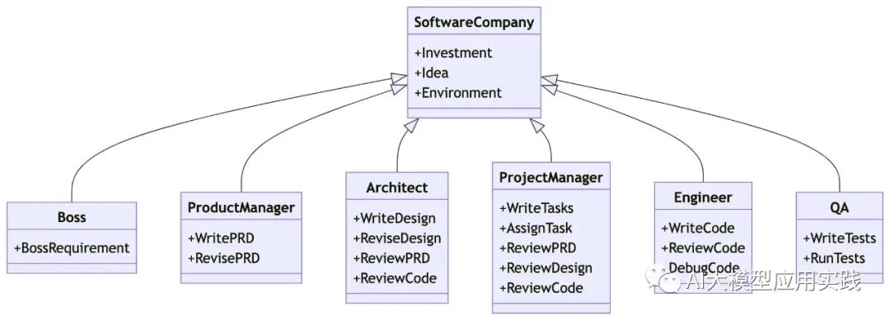

其他支持多Agent的开源框架包括微软的**AutoGen，xAgents**等。

### PART 02 企业知识助手

当前较为成熟的一种Agent类型。通俗地说，就是在企业应用中，**通过“外挂”私有知识库来扩充大模型的知识储备，以提供基于自然语言的、对话式的企业私有知识访问**（对应到AI Agent的基本能力之一：持久化记忆），**以解决通用大模型在面向企业应用时领域知识不足导致的幻觉问题。**

知识助手通常借助于大模型的**RAG（检索增强生成）**方案来实现，其本质上也是一种提示工程：**借助于在大模型输入时携带相关的私有知识上下文，让大模型理解、总结、整理并回答用户问题。**只是这里的私有知识上下文需要借助嵌入模型（Embedding Model）、向量数据库（Vector Store）、文档加载分割（Document Loader&Splitter）等相关技术来获得。

知识助手的技术实现基础架构如下：

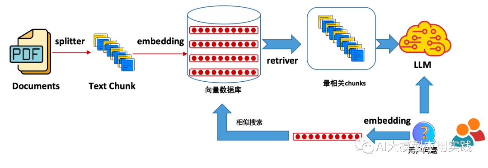

基于RAG方案的AI助手实现可以自行通过代码直接实现，当然，为了简化开发与管理过程，推荐使用的工具包括：

- **LangChain或者LlamaIndex大模型主流应用开发基础框架**。这两个基础框架对大量的模型、文档加载器、向量数据库、嵌入模型等做了抽象封装，并对RAG应用过程中的知识检索、Prompt组装等过程做了简化，可以大大简化开发过程。

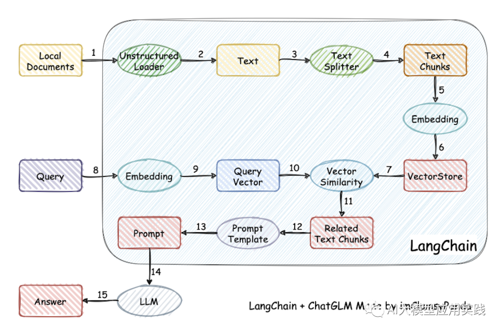

- **另一类是具备一定开箱即用能力的RAG应用构建平台。**相对基础开发框架来说，提供了更完善的RAG应用构建工具，比如私有知识库的管理维护、测试、对话流程编排、提示词自定义等能力。这里推荐两个项目，一个是基于Langchain构建的**Langcahin-Chatchat**；另一个是**FastGPT**，后者有用于商业运营的SaaS应用，可以自行体验。

  

### PART 03 数据分析助手

数据分析与商业智能(BI)在中大型企业的日常运营中的重要性毋庸置疑，无论是简单的财务数据分析，还是复杂的客户与运营数据洞察，都需要借助专业的工具。传统BI工具使用门槛高、过度依赖技术部门、结果产出周期长的问题在AI时代可以借助大模型的能力得以缓解。

基于大模型的数据分析助手（Data Agent）是**在企业应用中通过将自然语言转换成数据分析的语言或代码，比如对API的调用、对数据库的访问、甚至编写数据分析代码，来达到获取数据、分析数据与可视化结果的目的**。其实现基础架构与原理如下：

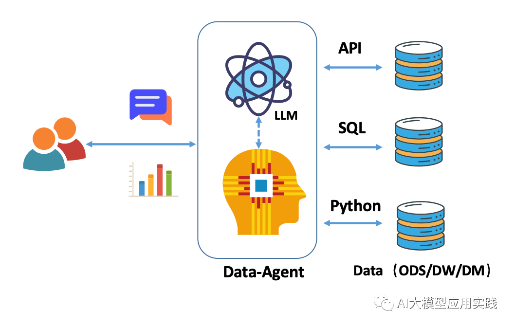

无论是对本地的Excel数据文件分析，或者对数据库中的关系型数据分析，又或者对互联网的非结构化数据分析，当前大模型实现数据分析的技术途径基本以这三种方式为主，**自然语言转API、转SQL、以及代码解释器（转代码）**。

数据分析助手我们在之前的文章中有详细阐述，请参考阅读：

[构建Data Agent：探讨企业应用中基于大模型的交互式数据分析及方案【上】](http://mp.weixin.qq.com/s?__biz=Mzk0MjUwMzY1MA==&mid=2247499548&idx=1&sn=ebc93ac4cf8525842cb2243e2facd646&chksm=c2c09c91f5b71587512d4ac81269d24e882366e84441249a7cd28013e6285c6aacd5bf6418d7&scene=21#wechat_redirect)

[构建Data Agent：探讨企业应用中基于大模型的交互式数据分析及方案【中】](http://mp.weixin.qq.com/s?__biz=Mzk0MjUwMzY1MA==&mid=2247499951&idx=1&sn=d0a0283fde58273de2b1325421cbf107&chksm=c2c0a322f5b72a341067ce7893d6964c6f1313892fe1d75655b1e50c2fe2341b9390289650f1&scene=21#wechat_redirect)

[构建Data Agent：探讨企业应用中基于大模型的交互式数据分析及方案【下】](http://mp.weixin.qq.com/s?__biz=Mzk0MjUwMzY1MA==&mid=2247500155&idx=1&sn=7e7438146d53dac97ca0a833e1b980e2&chksm=c2c0a2f6f5b72be05e173b72ed4e3922db8853f4fee8a054b8e41ec87ae184fe3e3e089f114f&scene=21#wechat_redirect)

这里推荐几个除Langchain之外构建数据分析助手的工具与项目：

- **DB-GPT：**一个国内团队的以重新定义数据交互为使命的强大开源项目，包含完整的前后台项目实现，实现了多场景下的交互数据分析。包括数据库分析、Excel分析、仪表盘分析等，该项目的另一个特点是后端大模型的可伸缩管理架构。另外还有一个专注于微调Text2SQL模型与评估的开源项目。

- **OpenAgents：**一个来自香港团队的开源项目，Data Agent是其中一个重要的Agent实现。当前主要实现了对本地结构化数据文档的数据分析，其特点是提供了两种数据分析方法供选择，一种是基于SQL，一种是基于代码解释器。

- **OpenInterpreter：**当前最强大的开源代码解释器，完美地复刻了OpenAI的代码解释器实现，但是可以完全在本地部署与使用，利用它来实现本地的数据分析与可视化是一个不错的选择。

  

需要注意的是：**数据分析助手严重依赖大模型对自然语言转数据操作的能力（SQL或Python代码等）。当然条件下，即使是针对这种场景专门优化的模型与提示工程，其失败概率也很高**（比如Text2SQL目前最高成功率在80%左右）。因此，在实际实施中需要根据场景、复杂性、可靠性要求做综合评估。

### PART 04 应用/工具助手

企业应用中的AI助手很多时候需要与现有应用（CRM、OA系统）做集成与交互，以完成某个用户任务或者驱动业务流程。比如：如果你需要AI帮你在协同办公系统中提交一个付款申请，那么你需要调用办公系统的接口；或者你需要借助互联网获得最新某上市公司的财务报告，你需要调用第三方平台的公开接口。这就是AI Agent另一项重要能力：工具使用。

**AI应用/工具助手就是能够把自然语言转换成对企业应用或者互联网开放API调用的一种基础Agent形式。**当然，在复杂任务场景下的这种调用往往不是单一的。其基础架构与原理：

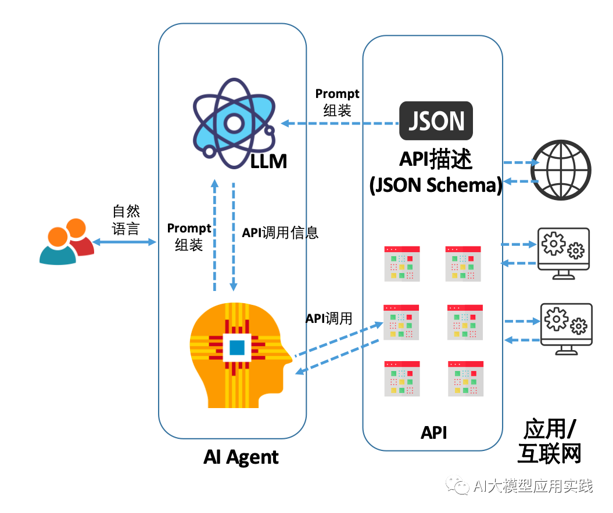

应用助手的基本原理是比较简单的，其复杂性主要体现在**大模型对自然语言转API的能力**，在实际使用中，其主要体现以下两个方面：

- 能否根据上下文理解，精确匹配到需要使用的API（一个或者多个）

- 能否准确地提取或生成每个API的调用参数

  

在实际测试中我们发现不同的大模型在这方面的能力是有较大的差异的，而且即使是最优秀的模型，也存在一定的不确定性，比如有时候无法判断出正确的工具。

在构建企业基于大模型的应用助手时，有一些工程问题是需要考虑的，**这些问题在做原型或者测试时容易被忽视：**

- **企业中API过多的优化方案**。由于需要通过Prompt提示LLM这些API信息，过多的API描述可能会导致上下文溢出；而且大量的API相互干扰，会提高大模型推理时的错误率。之前我们介绍过一种优化方案：借助向量库语义搜索，每次只检索出本次任务相关的API描述，再交给LLM处理。

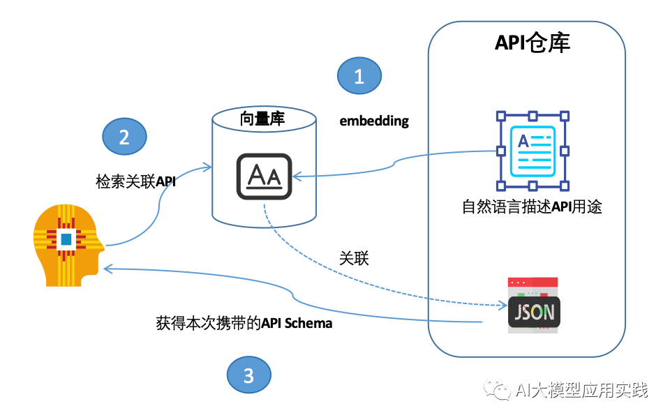

- **需要设计一个标准化的、容易扩展、易于插拔的工具/插件架构。**即能够灵活快速地扩展Agent的“工具包”，在增加新的工具时，通过简单的配置甚至自动化生成，即可给Agent动态赋予新的工具能力。

  

构建应用助手的一些工具和项目推荐：

- **LangChain**：LangChain中的Agent组件，通过组装多个Tools，封装与简化了大模型使用工具的过程，可以让你专注于Tools的创建即可。

- **Assistants API**：这是OpenAI官方最新放出构建AI助手的API，如果你条件具备，也可以基于此构建企业AI助手，充分利用其强大的gpt4模型。其中对工具的使用主要体现在其对Function Calling功能的支持。

- **OpenAgents**：该项目中的Plugins Agent实现了对大量开放API的智能使用，并且可以灵活配置增加新的Plugin，可以参考其实现。

- **集简云：**类似海外Zapier的平台。该平台对接了国内大量的SaaS应用与互联网平台作为“工具”。因此，你可以通过简单的配置后，在你的AI助手中通过API来对接这些工具，可以大大拓展你的AI助手的“工具库”。

  

### PART 05 Web助手

一种类似RPA（机器人流程自动化）的AI智能体。其主要能力是**自动化Web网络浏览、操作与探索的动作与过程，以简化web浏览访问与操作。**对于个人来说，可以作为个人数字助理，简单对话即可让AI帮你完成Web浏览与操作，比如在线订票。而对于企业来说，则可以**作为企业的数字员工，来简化企业日常工作中重复性较高、流程与规则固定、大批量的前端操作性事务。**比如批量订单处理、批量客户联络、批量网站抓取等，提高效率，降低错误率。

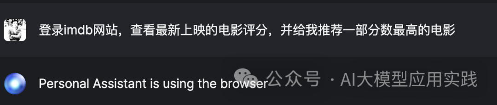

传统的RPA机器人也是用来完成此类工作的AI形式，由于这种AI机器人工作在软件的最上层即操作层面，好处是流程直观、简单、也可以配置化，且对应用无侵入性；但其缺点是与前端应用耦合性大，每个任务需要根据前端应用界面做精心配置与调试，自适应能力较差。

在大模型出现以后，给这一类RPA智能也带来了新的优化空间。**利用大模型的理解与分析推理能力，可以让AI更加智能的规划与分解任务过程，然后借助浏览器完成执行；且在未来可以利用像GPT-4V这样的视觉模型，更智能的理解界面元素与功能，实现完全自主的智能操作，具备更强的自适应能力。**

实现一个自主Web操作的Agent的基础原理与架构：

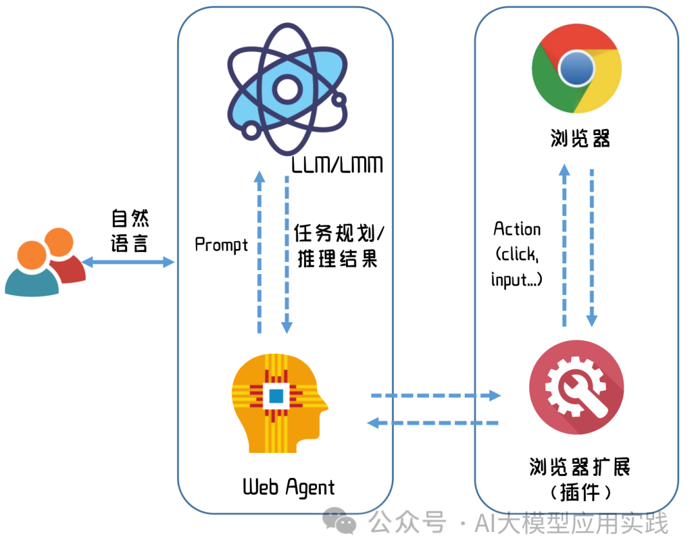

构建一个真实应用的Web Agent需要借助浏览器自身能力。**由于外部应用无法直接接管浏览器实现操作，一般需要借助浏览器插件，比如Chrom扩展，借助浏览器API完成网站导航与自动化网页操作，比如点击界面元素，或者输入表单。**

我们前面介绍到的OpenAgents项目中的Web Agent是一个基于Chrom浏览器与扩展而实现的一个LLM Agent，可以参考用作参考。

当然由于大模型的输出不确定性，当前的Web Agent仍然处于探索实验阶段，具有较大的失败或误操作可能，实际应用中需要根据情况反复测试与评估。

### PART 06自定义流程助手

最后一种AI Agent严格来说是上面的几种基础Agent能力的组合。

理想中的AI Agent是在丢给他一个工具包与一些知识以后，借助于大模型的理解、推理能力，完全自主的规划与分解任务，设计任务步骤，并智能的使用各种工具，检索知识，输出内容，完成任务。**但是在企业应用中，由于企业知识、应用、业务需求的千差万别，以及大模型自身的不确定性，如果这么做，那么结果很可能是“开盲盒”一样的不可控。**所以这也是越来越多的Agents项目要强调可控性的原因，即**能够对AI智能体的执行过程与细节进行更多的控制，来让AI按照人类确认过的工作流程来完成任务。**

比如之前我们介绍的HR简历自动化筛选的场景中，你可能需要更加细致的去定义整个自动化工作流程，包括：

- **主要的工作步骤与目标设定**
- **每个步骤使用的大模型
  **
- **每个步骤可以使用的工具**
- **可以输入与携带的知识与文档**
- **其他必要的限定与指令**

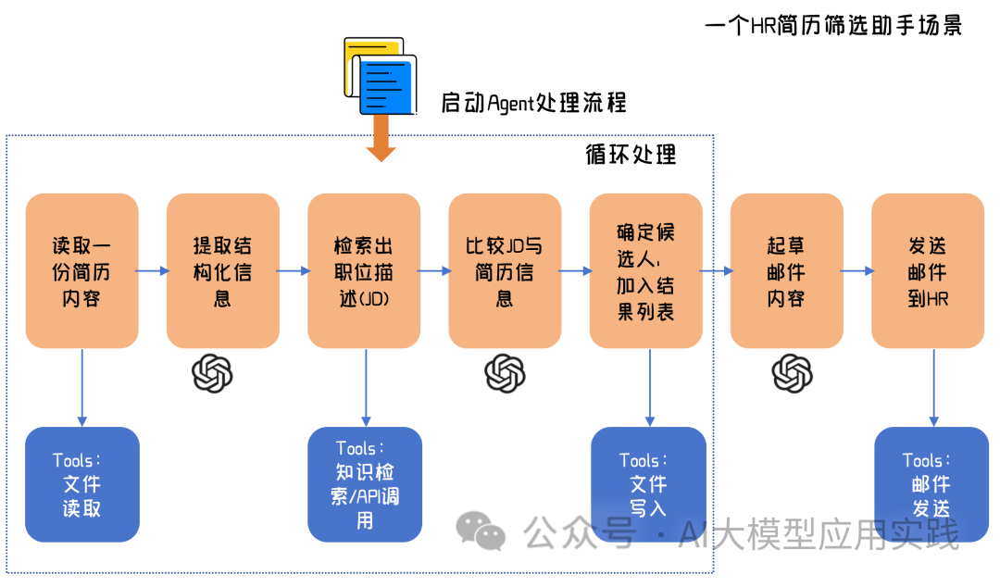

在实际应用中，这样基于LLM的工作流既可以是直接面向使用者的对话机器人来触发；也可以是完全后台触发。

实现这样的自动化工作流程AI智能体，除了借助Langchain/LlamaIndex这样的LLM开发框架直接定制外，还可以参考或利用一些开源项目：

- 借助类似**Flowise或者FastGPT**这样的具有LLM流程可视化编排能力的框架或平台，可以更加直观简单地定制任务流程

- 借助类似**SuperAGI**这样可快速简单化定制LLM流程的Agent框架来实现

  

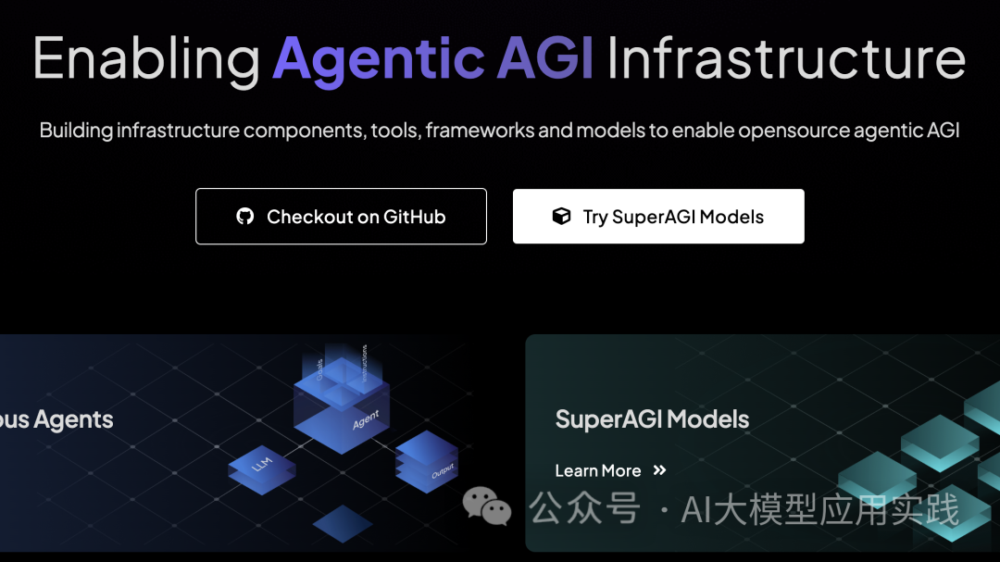

### PART 07结束语

以上，我们对企业应用中的大模型AI Agent从技术原理层面区分的几种类型做了简单探讨。实际上这里的每一种类型也都是一个可以深入的复杂话题，其中部分类型在之前的文章中也展开深入过，后续我们也会关注AI Agent技术趋势与发展，并在未来做持续分享。

> 引用：[一文说清：大模型AI Agent在企业应用中的6种基础类型](https://mp.weixin.qq.com/s/ArzlkcCW0gmXFRFRLszqTg?poc_token=HB_wxWWjO0h4SQ3nceBP_jQhOQaYISkvZkJA9HkO)

