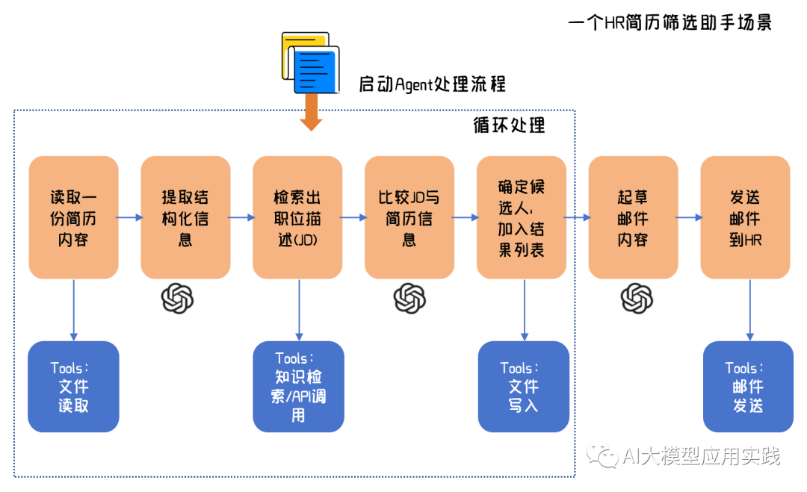
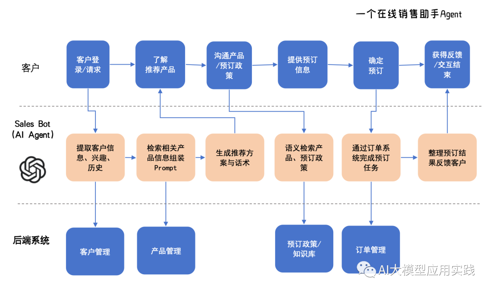
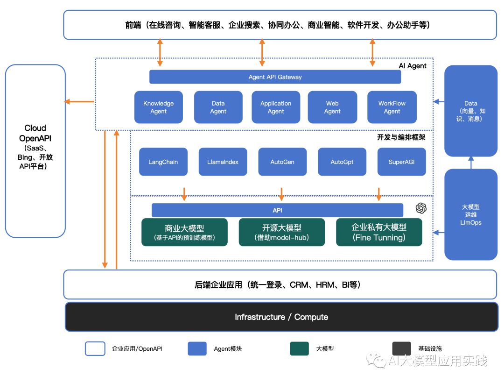
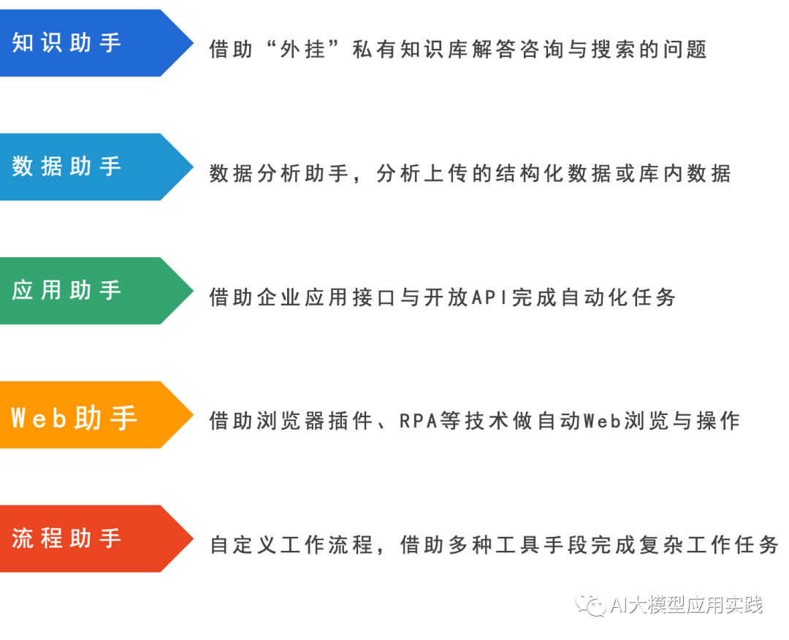

从前面的场景分析中我们也能看到，**企业中AI Agent的落地通常不是一个独立的简单工具项目（这是与ToC的AI Agent的最大区别）。**因此，也给现有企业IT的基础设施与架构带来了新的挑战：

- 可能需要部署与连接多种不同规模、能力的AI基础模型

- 必须与企业当前的数据与应用做标准化的、可扩展的集成

- 为了拓展Agent能力，可能需要借助开放API扩展其工具库

- 需要引入新的基础设施，比如向量库用以实现语义检索

- 面临新的大模型设施的运维管理需求

  

我们用两个具体场景来认识企业Agent应用的复杂性与对架构的要求。比如下面是一个设想的HR简历筛选助手的场景，可以看到，这样一个自动化处理的流程中，Agent需要能够灵活借助外部工具完成整个过程。

再比如下面这个在线销售助手的场景，借助于大模型的能力，并与现有的CRM模块、企业知识库等集成，可以智能的完成在线产品咨询与预订过程。

显然，你的**IT架构需要升级以将大模型与企业内部应用、开放工具等集成起来，构建Agent访问企业内部数据的管道，并能具备足够的弹性满足未来扩展的需要**。好在随着大模型的发展，相关的配套框架与工具也在不断演化与成熟，这些大模型的开发设施可以显著的帮助减少工作量，并应用最佳实践以降低风险。我们构建一个相对通用的AI Agent在企业应用的总体架构：

在这个总体架构中的引入的新的关键要素包括：

**1. 大模型**

包括大语言模型、嵌入模型以及逐渐发展的多模态模型，这些基础模型作为企业的AI基础设施与能力而存在。具体可以分为商业闭源大模型（比如ChatGPT，Gemini，通过API访问）、开源大模型（可以借助Model-hub平台进行部署与API访问，比如Llama）、私有大模型（借助开源模型做微调并私有化部署，首次投入成本较高）。

由于不同Agent对模型能力要求的差异，单个模型很可能无法满足更多场景使用要求，构建一个统一的大模型访问API层，实现多模型统一访问并可灵活切换是有必要的。

**2. 数据管理**

区分于企业现有应用的生产数据，Agent的独立数据区用于存取Agent管理与运行过程中的各种中间与持久数据，包括结构化与非结构化知识文档、向量数据库、分析数据、消息历史、日志数据等，并提供必需的数据维护与管理工具，如私有知识数据的清洗、向量化、导入导出等。

**3. 大模型运维管理**

具体来说应该包括LLM以及构建在LLM之上的各类Agent的运维管理，这包括了在应用生命周期不同阶段的管理工作。包括：

- **配置：**比如LLM输入的Prompt提示词、外部工具配置、Agent工作流配置、环境配置等。

- **测试：**大模型与Agent应用的测试。模型连通性、向量搜索测试、Agent状态测试、Agent性能测试等。

- **评估：**由于输出的不确定性，在大模型应用投入生产之前的评估非常重要，借助于一些框架可以对AI输出的准确性、相关性、合规性等做综合评估。

- **部署：**对模型与Agent的构建、部署与升级流程做自动化管理的过程。

- **监控：**对模型与Agent运行状态与结果进行跟踪监控。包括连通性、响应性能、数据安全性等。还有一个很重要的优化工作，即通过用户反馈搜集与分析来持续优化大模型或者提示工程。

  

**4. Agent智能体**

**开发框架层：**用于大模型应用开发的一系列开源的开发与编排框架、工具与平台。借助于这些工具，可以大大简化上游AI Agent构建的复杂度与工作量，并降低风险。常见的开发框架包括：LangChain、LLmaIndex、AutoGen、SuperAGI等。

**AI Agent层：**基于开发框架之上构建的真实投入应用的AI Agent。一方面，Agent通过API或代码解释器与内外部应用协作完成任务，另一方面，Agent本身通过API向前后端企业应用开放接口，以嵌入与集成到企业业务流程中，比如你可能需要集成一个AI Agent到企业微信/钉钉群来解答员工或者客户的问题。

这里我们根据常见企业应用中AI Agent的不同技术特点，把他们分成几类助手（由于内容创作与生成类的助手相对独立，更多时候体现ToC特征，这里我们不再列出）：

这里不同类型的助手在技术特征与实现工具上都有较大的区别，有的依赖向量技术，有的依赖大模型的Tools能力，有的需要借助代码解释器等，我们将在后续的文章中继续探讨。
