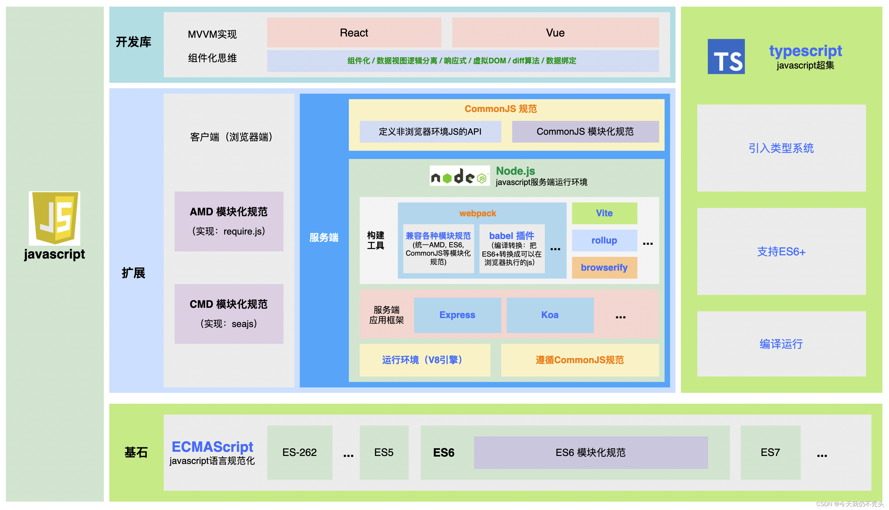

## 1.前端技术体系大图

> [前端技术体系](https://blog.csdn.net/csl1502011/article/details/113049691)

## 2.前端发展历史

### 2.1. Web 1.0 时代（1989～2004）

将 🔗 [**AJAX**](https://en.wikipedia.org/wiki/Ajax_(programming)) 技术出现前的 Web 时代称为 Web 1.0 时代，在这个时代里，网页的主要功能在于「**内容的展示**」。彼时「前端」这个概念还不甚明了，前端开发的工作还几乎由设计师兼任，他们同时负责网络应用的 UI，UX 设计，并使用 HTML，CSS 和 JavaScript 实现一些简单的交互功能。

这时前端主要负责的职能有 3 个：

- **SEO**；
- **网站视觉和交互效果的实现**；
- **浏览器兼容**；

🔗 [这篇文章](https://www.techopedia.com/definition/27960/web-10)介绍了 Web 1.0 时代的大致风貌。

------

### 2.2. Web 2.0 时代（1999～至今）

1999 年 AJAX 技术的出现预告着 Web 2.0 时代的到来，堪称标志性的事件是 2004 年 Google 发布了跨浏览器在线应用 Gmail。人们逐渐意识到，通过 AJAX 技术，在线应用可以获得和离线应用一样流畅的体验，并且在线应用在软件分发上有传统应用无可比拟的优势。随之发生的，就是各种形态各异，功能复杂的 Web 应用逐渐登上历史舞台，从 toC 到 toB，从浏览器端到桌面，手机，loT 设备，整个 Web 2.0 的时代序幕就此被拉开，并且这个舞台的灯光直至今日依然炫彩夺目。

#### 2.2.1. AJAX 与 Web 2.0

为什么 AJAX 技术有能力拉开新时代的序幕？答案要从 AJAX 技术本身说起，AJAX 是「Asynchronous JavaScript and XML」的缩写，他所提供的是「**让页面能够在渲染后继续向服务端发送请求，并在获得响应数据后，部分渲染页面**」的能力。

虽然这项能力现在看来毫不稀奇，但这项技术**本质上加快了信息的流通速率**。在 Web 1.0 时代，客户端想要获取数据，**其数据的载体是 HTML 文档**。这意味着用户每次请求新数据时，都需要等待一次页面刷新，在有限的带宽下，Web 1.0 时代的每次信息传输（无论是单向还是双向），都需要漫长的等待，其体验远不如各种成熟的离线应用。

而 AJAX 技术的出现，不仅**将数据载体从 HTML 文档转变为 JSON 或 XML 数据块**，还**提供了一种新的数据的获取方式：异步获取数据**。这使得**在线应用可以在避免页面刷新的同时，以用户几乎无感知的方式更新页面数据，这不仅让用户在使用体验上与离线应用保持一致，更重要的是，由于服务端有能力 24 小时不间断地吞吐海量的数据，它为在线应用的未来孕育了无限可能**。

从数据持有者与持有方式的角度看，在 Web 2.0 时代，数据不再是由少数人创造供大多数人消费，所有人都可以同时消费和创造数据，于是，Web 世界的数据规模和应用规模形成了相互反馈，相互促进的正向循环，整个 Web 世界正式进入高速发展的黄金时代。

**📖 扩展阅读：**

- 🔗 [Web 2.0](https://static.googleusercontent.com/media/www.google.com/en//a/help/intl/en/security/pdf/web_2_new_face.pdf)
- 🔗 [wiki Web 2.0](https://en.wikipedia.org/wiki/Web_2.0)

------

#### 2.2.2. Web 2.0 带来的前端变革

随着 Web 应用规模的不断增加，程序复杂度的不断上升，应对场景的不断多样化，终于，前端开发职能开始复杂到设计师或后端开发者无法通过「兼职」完成，这不仅促使「**独立的，专业的前端开发岗位成型」**，还带来了一种是新的，更高效的软件开发协作方式：「**前后端分离**」。

##### 2.2.2.1. 前后端分离

前后端分离又称为「前后端解耦」，顾名思义，其实践上表现为前后端开发彼此独立开展，相互之间仅通过 API 交互的协作模式。其意义在于 **Web 应用可以通过几乎「并行开发」的模式，极大地提高产品的迭代速率**。

🔗 [这篇文章](https://inviqa.com/blog/decoupled-architecture-how-modernise-your-frontend)在这个主题上有更加深入的介绍。

------

##### 2.2.2.2. SSR 1.0 -> CSR -> SSR 2.0 -> SSG

前后端分离的组织架构除了带来了生产关系上的变革，也促使了**动态页面生产方式的变革**。

> 💡 此处的「动态页面」是指，页面内容会根据不同用户的请求而发生变化。

###### 2.2.2.2.1. SSR 1.0

在 Web 1.0 时代，页面的生产依赖于服务端框架，所谓的前端开发者需要在框架提供的模版中撰写 HTML，CSS 并完成数据的绑定。由于页面是在服务端生产的，因此将这种页面生产的方式称为 **SSR（Server Side Rendering）。**

> 🔗 图片来源：https://inviqa.com/blog/decoupled-architecture-how-modernise-your-frontend

------

###### 2.2.2.2.2. CSR

而在 Web 2.0 时代，基于前后端分离的协作方式，前端掌控了页面的功能逻辑和路由，这导致一种新页面渲染方式的诞生：**客户端渲染（CSR：Client Side Rendering）**。

在这种模式下，服务端返回的只是一个几乎没有任何内容的 HTML 文件，而 HTML 页面内的所有内容和路由都由前端负责动态渲染，**服务端专注于 Model 与一部分 Controller 层的开发，复杂的 View 层完全交给前端负责**。

------

###### 2.2.2.2.3. SSR 2.0

虽然 CSR 方案看起来很美好，可以完美的实现前后端解耦，让上帝的归上帝，凯撒的归凯撒，但是对于 C 端应用而言，采用 CSR 方案的应用还存在以下缺陷：

- **无法进行搜索引擎优化（SEO：Search Engine Optimization）**；
- **首页白屏带来的用户体验问题**；

为了克服这些问题，一种新的渲染方案油然而生：**服务端渲染（SSR：Server Side Rendering）**。

虽然看起来似乎是兜兜转转，页面渲染的控制权又回到了最初的起点，但此时的 SSR 其实具备了更多的内涵，其中最核心的一点是，随着 Node.js 技术的成熟，使前端开发者可以采用一种称为「**同构**」的技术**使用一套代码，将一个动态页面拆分为初始页面（包含 SEO 所需的必要信息）和完整页面（包含完整的页面数据）两个部分，并在服务端生成初始页面，从而解决首页白屏和 SEO 问题，并在客户端渲染时渲染更多页面细节**。

这种技术既可以完全在服务端使用，也可以作为一个 FaaS 服务运行在服务端与客户端中的中间层，从而在保障前后端分离的前提下，解决前端渲染切实存在的问题，并且，还附带额外的一个好处：**由于页面实际上已经在服务端侧提前烘焙了一部分，所以在客户端渲染时会更快！这十分有利于页面性能的提升**。

------

###### 2.2.2.2.4. SSG

应该可以察觉出，前端正在开始逐渐向后端发展，前端开始有能力使用 JavaScript 构成 Web 服务，响应用户的请求。也是在这个时期，前端社区开始进一步探索更高效地页面渲染方案，此时名为「**静态站点生成（SSG：Static Site Generation）**」的技术开始获得广泛的关注。

它的核心思想是根据**页面的展示内容是否会根据不同用户而不同，将数据驱动的页面进一步的分类，对于一旦数据注入后，页面内容始终不变的页面，提供了一种在代码构建时，自动生成页面的能力。**当用户请求这些页面时，页面的响应速度将和静态页面保持一致，并且也十分有利于 SEO。

下方这篇文章进一步解释了 SSG 与 SSR 技术的差异：

- 🔗 [ssg vs ssr in next js web applications choosing the right rendering approach](https://aws.amazon.com/blogs/mobile/ssg-vs-ssr-in-next-js-web-applications-choosing-the-right-rendering-approach/)

------

##### 2.2.2.3. SPA

在介绍页面渲染方式的发展时，提到了 **CSR（Client Side Rendering）**。它所对应的应用形态即是「**单页面应用（SPA：Single Page Application）**」。

一个典型的单页面应用有如下特征：

1. **应用的服务端负责提供页面所需的数据，并通过 RESTful API 与客户端交互；**
2. **在响应用户请求时，服务端仅返回一个空壳页面；**
3. **页面的所有视觉样式，交互功能，状态管理和路由跳转都由前端负责实现**；

🔗 [这篇文章](https://www.bloomreach.com/en/blog/2018/what-is-a-single-page-application)详细地介绍了 SPA 这个概念：

在这种情况下，仅仅是实现一个功能复杂的 Web 应用的前端部分，其代码量及逻辑复杂度也将是惊人的。为了维持应用的稳定运行，并能够持续迭代，前端开发社区相继给出了一系列方案，其中最为核心的两项是：

1. **渐进式升级前端开发语言**；
2. **打造现代 Web 前端框架**；

###### 2.2.2.3.1. 渐进式升级前端开发语言

前端开发的三大语言基础：HTML，CSS 和 JavaScript，在 Web 2.0 时代纷纷制定新的标准和规范以应对不断变化发展的市场需要。

对于 HTML 和 CSS 而言，两者分别升级到了 HTML 5 和 CSS 3，增加了一系列实用的功能，让前端开发在视觉表现和交互上有更丰富的表现力和表现手法。

> ⚠️ HTML 5 和 CSS 3 的语义是新一代的 HTML 和 CSS，所有后续的升级都囊括在这个语义中，因此理论上不存在 HTML 6+ 或 CSS 4+。

- 🔗 [参考教程：intro-to-html-and-css--ud001](https://www.udacity.com/course/intro-to-html-and-css--ud001)

对于 JavaScript 则是几乎保持每年一次迭代的更新频率，点击🔗 [此处](https://www.w3schools.com/js/js_versions.asp)可以看到每次语言更新后添加的功能：

语言自身的升级为前端开发者带来了更强的功能实现能力，同时也降低了功能实现的成本。但是对于前端开发而言，另一个问题也越发凸显：「**浏览器兼容性**」。

由于新的语法规范需要现代浏览器在内核层面予以支持，但是不同浏览器对各种语法的支持程度，支持速率也不经相同，这导致了使用现代前端语言编写的应用需要想办法尽可能在更多环境中运行。最终，为了解决这个问题，「**前端构建**」—— 一个新的领域被开辟出来，登上前端开发的舞台。

------

###### 2.2.2.3.2. 打造现代 Web 前端框架

除了语言层面上的渐进式升级，针对逻辑非常复杂，状态管理难度非常大的项目，前端也急需一套系统化的解决方案让整个项目变得容易维护。于是，一系列现代 Web 框架应运而生，它们无一例外的**采用组件化，模块化的设计理念，将整个大项目去拆解，解耦成彼此独立的模块以降低开发者研发心智，提升项目的可维护性**。

在一系列的轮替后，当前最具代表性的三大前端框架为：

- **🔗** [**React**](https://react.dev/)
- **🔗** [**Vue.js**](https://cn.vuejs.org/)
- **🔗** [**AngularJS**](https://angularjs.org/)

------

#### 2.2.3. Node.js 与全栈开发工程师

除了前端语言和框架在 Web 2.0 时代的高歌猛进之外，2009 年由 Ryan Dahl 完成并发布的 🔗 [**Node.js**](https://nodejs.org/en) 使前端开发者得以涉足服务端开发领域，并**有能力出色地应对 Web 服务器高并发的问题**。而 Node.js 之所以被设计出来，其意图也正在于此。

之所以 JavaScript 能够走出浏览器环境运行在服务端，核心是因为 Chrome 开源了其 JavaScript 解析引擎 — V8 引擎，该引擎的主要作用在于：

1. **解释与编译 JavaScript；**
2. **堆管理；**
3. **处理内存垃圾回收；**
4. **处理内存分配等；**

本质上说，**V8 引擎提供了一个 JavaScript 的执行环境**，而这个环境可以被移植到任意上下文中。而 Node.js 之所以有能力应对 Web 服务器高并发的问题，在于 JavaScript 的异步机制可以通过避免 I/O 阻塞，提升 Web 服务器的响应速率。

Node.js 的出现大大扩展了 JavaScript 的应用场景，对于 Web 服务而言，一系列的 Web 框架应运而生（例如 🔗 [**Express**](https://www.express.com/)，🔗 [**Koa.js**](https://koajs.com/)，🔗 [**Egg.js**](https://www.eggjs.org/) 等），而随着 MongoDB 这种非关系型数据库的出现，一种新的全栈架构也逐渐成熟：**MERN（MongoDB + Express + React + Node.js）**：

> 🔗 图片来源：https://www.mongodb.com/mern-stack

至此，基于 JavaScript 语言的全栈工程师正式登上历史舞台。

**📖 扩展阅读：**

- 🔗 [Introduction to Node.js, v3](https://frontendmasters.com/courses/node-js-v3/)【💰】
- 🔗 [Full Stack for Front-End Engineers, v3](https://frontendmasters.com/courses/fullstack-v3/)【💰】

还记得之前提到的「同构」概念吗？社区的开源明星项目，一个基于 React 的全栈框架 🔗 [**Next.js**](https://vercel.com/solutions/nextjs?utm_source=google&utm_medium=cpc&utm_campaign=16369030002&utm_campaign_id=16369030002&utm_term=next js&utm_content=139376545808_665293501437&gad=1&gclid=Cj0KCQjw9rSoBhCiARIsAFOiplmj5Z8M2T2QsHE3bjDQ1i5g5aMS3l9PKtqh5eYwtoqrweHA9YpiwSkaAtv4EALw_wcB) 将这个概念发挥到了极致，它通过提供一系列工具用于解决 Web 应用开发，部署中的通用问题。

------

#### 2.2.4. 多端渲染

受益于 Node.js 的不止是 Web 服务，当 JavaScript 得以走出浏览器，人们立刻意识到 JavaScript 在其他场景中的巨大潜力，基于 Node.js 提供的 JavaScript 运行时，人们意识到可以使用 JavaScript 开发桌面端应用，其中最著名的框架是 🔗 [**Electron**](https://www.electronjs.org/)，它提供了操作系统层面的一系列 API，让前端开发者可以通过一次编写代码，同时生产出适应多种操作系统的桌面端应用。

- 🔗 [Electron, v3](https://frontendmasters.com/courses/electron-v3/)【💰】

基于这个思路，人们越来越发现 JavaScript 有广泛的适用场景，甚至 2007 年，Stack Overflow 的联合创始人 Jeff Atwood 就提出了著名的 Atwood 法则：

> 一切能被 JavaScript 编写的应用，终将被 JavaScript 编写！

> Any application that can be written in JavaScript, will eventually be written by JavaScript.

> 🔗 引用来源：https://blog.codinghorror.com/the-principle-of-least-power/

从某种程度上说，Atwood 预言对了，得益于智能手机的普及，万物互联概念的落地，**前端开发所需应对的场景从浏览器端逐渐扩散至服务器端，桌面端，移动设备，loT 设备以及各种带有 UI 界面的场景**。

之所以 JavaScript 能够被运用在各种终端设备，除了 Node.js 提供的可移植的 JavaScript 运行时环境外，还在于 JavaScript 比 Java 更好的实践了 WORA（Write Once, Run Anywhere） 的理念，其中最具代表性的是 React 推出的 🔗 [**React Native**](https://reactnative.dev/) 框架，它可以让前端开发者使用 JavaScript 编写应用代码，并通过编译创建出可以在 iOS 和 Android 系统中运行的移动端应用。

您可以通过该 🔗 [Coursea 课程](https://www.coursera.org/learn/react-native-course?specialization=meta-android-developer&utm_source=gg&utm_medium=sem&utm_campaign=B2C_NAMER_meta-android-developer_meta_FTCOF_professional-certificates_facebook-meta-country-US-country-CA&utm_content=B2C&campaignid=18179464241&adgroupid=152198855976&device=c&keyword=&matchtype=&network=g&devicemodel=&adpostion=&creativeid=667178889285&hide_mobile_promo&gclid=Cj0KCQjw06-oBhC6ARIsAGuzdw2Ye4DOUKtadvA9XkoI8_FxSDkLepHo9jleOJEDgexR4NsI02j3MMkaAvoJEALw_wcB)了解更多关于 React Native 的概念。

------

### 2.3. Web 3.0 时代（2021~至今）

得益于区块链技术的发明和以太坊的出现，一些人认为现在正在进入一个新的时代：Web 3.0 时代。从信息的角度上讲，Web 3.0 的数据由于保存在区块链中，所以相较于 Web 2.0 时代，信息不再集中在少数商业主体手中，从而变得更加透明，开放。

而从技术上看，**Web 3.0 时代实际上摧毁了 Web 2.0 时代的数据基础设施（数据库等），并重塑了服务端开发的职能，主要是和区块链做交互。并诞生了一种新的职业：区块链工程师。**

但是对于前端而言，Web 3.0 带来的冲击却并没有那么大，前端依然负责用户的视觉和交互部分，并尽力保障应用程序的性能和安全。对于前端开发而言唯一的改变是**原来需要在数据和服务层对接服务端 API 转变为要与区块链 API 进行交互**，并且由于区块链数据一经撰写，不可改变的特性，对于代码的精确性，安全性有了更高的要求。

为了与以太坊中的智能合约交互，还催生出了一种新的编程语言，它的设计受 JavaScript 启发，并融合了其他高级语言的众多特性 —— 🔗 [**Solidity**](https://soliditylang.org/)。

**📖 扩展阅读：**

- 🔗 [The Complete Solidity Course - Blockchain - Zero to Expert](https://www.udemy.com/course/the-complete-solidity-course-blockchain-zero-to-expert/?referralCode=F04A3289FE038DB0257B&utm_source=adwords&utm_medium=udemyads&utm_campaign=DSA_Catchall_la.EN_cc.US&utm_content=deal4584&utm_term=_._ag_95911180068_._ad_532194018659_._kw__._de_c_._dm__._pl__._ti_dsa-406594358574_._li_21137_._pd__._&matchtype=&gclid=Cj0KCQjw06-oBhC6ARIsAGuzdw1b-YWBu5zJggMAYPyz9NasOhAyNFgE5b5x-uiPLOukLzCDPV3ENfoaAoD_EALw_wcB)【💰】
- 🔗 [A Tour of Web 3: Ethereum & Smart Contracts with Solidity](https://frontendmasters.com/courses/web3-smart-contracts/)【💰】

下方这篇文章介绍了开发 Web 应用所需了解的一些核心概念以及 Web 开发的历史：

- 🔗 [Web Applications 101](https://www.robinwieruch.de/web-applications/)

------

## 3. 前端领域的重要概念

通过介绍 Web 前端的发展历史，可以看到现代前端经历了一阵飞速发展后，如今其能力触角已经覆盖到互联网世界的方方面面，成为一股不可忽视的存在。在下面的部分，将着重介绍现代 Web 前端开发中的一些核心概念，让您对其有一些大概的了解。

### 3.1. React

之前提到过在 Web 2.0 时代，Web 应用的普遍特征在于前端应用逻辑相较于 Web 1.0 时代变得非常复杂，这需要前端框架提供相应的解决方案，在众多的前端框架中，由 Facebook 开发的 🔗 [**React**](https://react.dev/) 最终成为市场上最受欢迎的前端框架，原因在于它提供了如下能力：

1. **虚拟 DOM**：为了避免复杂交互应用下用户频繁操作导致页面频繁重绘，造成应用卡顿，用户体验下降，React 独树一帜的使用复刻真实 DOM 结构（HTML 标签映射出的一树结构）的方法，将用户多次操作的影响在虚拟 DOM 中合成为一次改动，然后统一更新页面；
2. **组件化**：在 React 中，每个页面 UI 元素都可以以「组件」方式被创造和组合，每个组件都像一个乐高积木，一块块搭成最终的复杂应用。每个组件都包含了 HTML，CSS 和 JavaScript 代码，基于这一设计，出现了例如 🔗 [**Antd**](https://ant.design/)， 🔗 [**Material-UI**](https://mui.com/material-ui/) 等实用的组件库，提供封装好的基础组件，极大的提升了前端开发者的开发效率；
3. **单向数据流**：对于复杂的项目，科学的状态管理是保障项目可稳步迭代的关键，对此，React 提供的状态管理解决方案为每个组件的状态只能向下以只读方式传递，不允许下游组件直接更改顶层状态，从而让整个应用的状态尽可能保持可控。

通过浏览下方的课程，可以对 React 有更加深入的理解：

- 🔗 [React Basics](https://www.coursera.org/learn/react-basics?specialization=meta-android-developer&utm_source=gg&utm_medium=sem&utm_campaign=B2C_NAMER_meta-android-developer_meta_FTCOF_professional-certificates_facebook-meta-country-US-country-CA&utm_content=B2C&campaignid=18179464241&adgroupid=152198855976&device=c&keyword=&matchtype=&network=g&devicemodel=&adpostion=&creativeid=667178889288&hide_mobile_promo&gclid=Cj0KCQjw06-oBhC6ARIsAGuzdw2IsTQMN8JO5EUWK3-W1up8ZCO2I34qJlSp4Se37XJf05zhNzJK7s4aAimYEALw_wcB)
- 🔗 [Complete React](https://frontendmasters.com/courses/complete-react-v8/)【💰】

------

### 3.2. TypeScript

JavaScript 是一门弱类型的脚本语言，还默认提供了隐式类型转换的能力。这虽然十分有利于快速编写程序，但是对于构建大型项目而言，**这常常带来许多难以察觉的问题，不利于项目长期维护和迭代**。为此 MicroSoft 发布了 🔗 [**TypeScript**](https://www.typescriptlang.org/) 来弥补 JavaScript 在类型约束上的不足。**TypeScript 是 JavaScript 语言的超集，它继承了所有 JavaScript 的语法，并提供了完善的类型约束和类型推倒**，从发布之初就广受社区欢迎。现在已经成为高工程质量项目的不二之选。

下方是关于 TypeScript 的两个课程：

- 🔗 [Introduction to TypeScript](https://www.udemy.com/course/typescript/?LSNPUBID=JVFxdTr9V80&ranEAID=JVFxdTr9V80&ranMID=39197&ranSiteID=JVFxdTr9V80-vFokafth7ipqPByszK1Qsw&utm_medium=udemyads&utm_source=aff-campaign)
- 🔗 [TypeScript Fundamentals, v3](https://frontendmasters.com/courses/typescript-v3/)【💰】

然而，虽然 TypeScript 看起来很美好，**但是浏览器并不支持解析 TypeScript 语法**，因此，对于使用 TypeScirpt 创建的代码而言，需要在正式发布前进入一个「**编译阶段**」，在这个阶段中，TypeScript 代码会被翻译为 JavaScript 代码供浏览器消费，而要介绍这个多出来的「编译阶段」就自然而然的进入了将介绍的下一个主题：**工程化**。

------

### 3.3. 工程化

广义上讲，前端的工程化是一个很大的概念，它包含了除编写业务逻辑代码之外的所有内容：

- 项目启动；
- 项目标准化；
- 提供项目开发时的调试环境：即时编译，模块热更新，浏览器同步等；
- 代码构建：代码转译，混淆压缩，格式化等；
- Git Flow；
- CI / CD；
- IDE；
- ...

但是无论如何，其最终的目标都是为了**提升开发效率，项目质量和上下游的协作效率**。

纵观最近几年的前端社区发展，最广泛的讨论和最显著的发展都集中在**代码构建领域**。为什么 JavaScript 作为一门脚本语言需要构建？其实之前在介绍前端发展历史中已经给出了答案，总的来说是为了解决以下方面的问题：

1. **语言版本兼容**：各浏览器版本在语言标准实现上存在差异（由于前端开发语言标准一直在更新），因此在代码构建时需要将源代码通过工具转译为目标终端可识别的代码；
2. **语言类别兼容**：无论是 TypeScript 还是 React 框架依赖的 JSX，其都有自己的语法规范，使用这些语法规范编写的代码不会被浏览器识别，同样需要被转译；
3. **性能优化**：为了提升页面性能，缩小资源体积，往往在构建时会对源代码执行混淆压缩，输出压缩后的代码；
4. **终端类别兼容**：要想实现「Write Once，Run Anywhere」的美好愿望，就需要在代码构建这个环节将源代码转换为不同平台可执行的代码；
5. **其他诉求**：在这个过程中，还可以根据用户的特定需求执行如图片压缩，语法检查，代码格式化等优化操作。

目前，主流的 JavaScript 转译工具是 🔗 [**Babel**](https://babeljs.io/)，而主流的构建工具有 🔗 [**webpack**](https://webpack.js.org/)， 🔗 [**rollup**](https://rollupjs.org/) 等。

随着前端项目需求的复杂度越来越高，使用 JavaScript 实现的这些工程工具也渐渐遇到了效率瓶颈，对于一个超大型的项目，可能每次发布前的构建时长就可以达到十几分钟，这显然令人难以接受的。社区对此的应对方案是使用更底层的语言 —— Rust 重新编写构建工具，这种选择最终被证明是明智的，使用 Rust 开发的 Babel 替代品 🔗 [**swc**](https://swc.rs/)，webpack 替代品 🔗 [**Turbopack**](https://turbo.build/pack)，🔗 [**Rspack**](https://www.rspack.dev/) 都在项目的构建速度上带来了质的飞跃。

现代 Web 前端的构建工具由于要应对不同的需求场景，导致其在设计上相当灵活，要想出色地进行工程层建设，需要对各类构建工具有深入的理解，下面的课程是对当前最流行的构建工具的介绍：

- 🔗 [Webpack Fundamentals](https://frontendmasters.com/courses/webpack-fundamentals/)【💰】

#### 3.3.1. 包管理工具

在包依赖和包管理上，前端社区给出的方案是 🔗 [**npm**](https://www.npmjs.com/)，它类似于 Mac 的 Homebrew，Java 的 Maven 或 Rust 中的 Cargo，负责安装，管理 JavaScript 生态中的各类依赖。从狭义上说，npm 是一个包管理工具，但是从广义上讲，npm 实现了整个 JavaScript 依赖生态的方方面面。包括提供一个开放的 registry 托管全球前端开发者的模块，库或框架。

Node.js 在设计之初，就坚持将核心库做的足够小，以便让充分发挥社区的创造性，让所有搭建大型系统的构建都尽可能来源于社区，因此每个构件都可以快速试错和迭代。这种开放的态度一方面收获了巨大的回报：**Node.js 拥有了全世界最活跃也是最大的社区和包管理平台** **npm。**

但另一方面，这也带来了一个显著的问题：过于原子化的包使得大型项目的依赖数量变得非常大，由于依赖的包还依赖其他包，所以最终，Node.js 默认的包安装目录 node_modules 的体积将非常巨大。

> 🔗 图片来源：https://javascript.plainenglish.io/node-js-esm-npm-yarn-deep-dive-adda15dabce

从工程实践上讲，Node.js 的包管理方案目前有两个发展趋势：

1. **包管理工具的革新：**采用各种方式优化包依赖安装时间，除了 npm 外，开发者现在还有 🔗 [**yarn**](https://yarnpkg.com/)，🔗 [**pnpm**](https://pnpm.io/) 等包管理工具可供选择，它们都基于 npm 建立的生态进行局部优化；
2. **包管理平台私有化部署 + 企业级解决方案**：利用企业自有云资源，实现包的私有化部署，并提供各种贴合企业应用场景的功能和服务；

------

### 3.4. 其他领域

除了上面提及的通用前端开发领域外，现代前端开发还发展出一些专门领域，也在此做大致的介绍。

#### 3.4.1. Web Assembly

简单来说 Web Assembly 是继 JavaScript 之后，有一种能被浏览器识别的编程语言，不过与 JavaScript 不同，它更加底层，这意味着，它拥有更好的性能。

虽然开发者可以手动编写 Web Assembly 代码并使其在浏览器中执行，但 Web Assembly 其实意不在此，其**核心是提供了一种目标语言，方便使用 C，C++，Rust 这些高级语言编写的代码通过编译为这种语言，从而让程序获得在浏览器执行的能力**。

下面的课程介绍了 Web Assembly 的基础概念：

- 🔗 [Web Assembly (Wasm)](https://frontendmasters.com/courses/web-assembly/)【💰】

------

#### 3.4.2. 数据可视化

数据可视化指**将数据转换为图形来表达的过程**。常说「一图胜千言」，通过可视化图表，更容易更快速地洞察数据的模式和蕴涵的意义。

> 🔗 图片来源：https://observablehq.com/plot/features/marks

数据可视化通常使用 Canvas 提供的 API 或 SVG 来实现，其核心需要关注绘图效果的实现与性能。目前较为知名的数据可视化框架由 🔗 [**D3.js**](https://d3js.org/)，🔗 [**AntV**](https://antv.antgroup.com/) 和 🔗 [**EChartsJS**](https://echartsjs.com/index.html)。它们都封装了底层的绘图 API，并提供了一些常用图表组件。

下方是关于可视化编程的免费课程：

- 🔗 [information visualization programming d3js](https://www.coursera.org/learn/information-visualization-programming-d3js)

数据可视化不仅局限于静态数据，它还可以扩展到音频领域：

- 🔗 [web-audio](https://frontendmasters.com/courses/web-audio/)【💰】

------

#### 3.4.3. 动画 & 游戏

前端动画领域非常有意思，它力图在浏览器中展示各种动画效果，无论简单的动效，还是较为复杂的 2D，3D 动画，前端都有专门与之对应的解决方案，从使用的语言上可以划分为 CSS 和 JavaScript 两种类型。

- **CSS 动画**；实现的效果有限，但通常性能更佳；
- **JavaScript 动画**：可以实现复杂的动画效果，但性能不如 CSS；

在前端 3D 动画领域，知名度最高的应是 Three.js 框架，他通过**封装 GLSL，向上层暴露 JavaScript API 的方式**，使前端可以通过 GPU 高效绘制各种令人惊奇的动画效果，下面的网页内容展示了这一点：

**📖 扩展阅读：**

- 🔗 [CSS Animations](https://frontendmasters.com/courses/css-animations/)【💰】
- 🔗 [threejs journey](https://threejs-journey.com/) 【💰】

随着 WebGPU 的推出，浏览器终于有机会使用现代 GPU 提供的如光线追踪等能力，Three.js 也宣布会在底层兼容 WebGPU，相信未来前端动画领域将有更广阔的未来。

**📖 扩展阅读：**

- 🔗 [Introducing WebGPU: Unlocking modern GPU access for JavaScript](https://www.youtube.com/watch?v=m6T-Mq1BPXg)

> 💡 前端动画的进一步发展，是 Web 游戏，在集团中，互动团队研发了一款专注于开发互动游戏的前端游戏引擎 — 🔗 [**Eva.js**](https://eva-engine.gitee.io/)，能够支持大多数 2D 互动游戏的开发，而对于 3D 游戏，也研发出专门的游戏引擎 🔗 [**Hilo3d**](https://github.com/hiloteam/Hilo3d) 并在社区开源。

------

#### 3.4.4. 音视频

随着流媒体，直播行业的兴起，前端衍生出了多媒体技术方向，其意义在于实用前端技术解决多媒体场景下的各种问题，例如：

- **扩展浏览器媒体播放功能**：如视频分段加载，码率切换，内存管理等；
- **开发实时音视频通话应用**：处理实时音视频传输过程中的各种问题；
- **直播推流，音视频剪辑软件**：保障多端设备播放效果，提供音视频剪辑工具等；

**📖 扩展阅读：**

- 🔗 [多媒体技术前端入门指南](https://ata.atatech.org/articles/11000207689?spm=ata.25287382.0.0.63277536bbSYqz#QsDPXaKE)

------

#### 3.4.5. 微前端

**微前端（Micro Frontends）**的概念是由 ThoughtWorks 在 2016 年提出的，它借鉴了微服务的架构理念，核心在于将一个庞大的前端应用拆分成多个独立灵活的小型应用，每个应用都可以独立开发、独立运行、独立部署，再将这些小型应用融合为一个完整的应用，或者将原本运行已久、没有关联的几个应用融合为一个应用。

还记得之前在讲述 Web 2.0 历史时，提到了软件工程的人员组织架构**从一整个团队开发的模式转变为前后端分离开发的模式**。

而在**微服务（Micro Services）**概念出现后，软件工程的人员组织架构又进行了一次升级，每个具体的服务都划分为一个专门的团队负责开发和维护，整体架构的改变如下图：

> 🔗 图片来源：https://micro-frontends.org/

而微前端概念的提出则是基于这种新型组织架构下的一种反应，它从更上层将前端功能根据业务属性进行拆分，并落地到不同的团队中，因此前后端在「微」这个概念上得以重新聚首：

> 🔗 图片来源：https://micro-frontends.org/

目前前端流行的微前端框架有海外的 🔗 [**single-spa**](https://single-spa.js.org/)，国内蚂蚁出品的 🔗 [**qiankun**](https://qiankun.umijs.org/zh)。

**📖 扩展阅读：**

- 🔗 [Micro Frontend - extending the microservice ideo](https://micro-frontends.org/)
- 🔗 [Micro Frontends](https://martinfowler.com/articles/micro-frontends.html)
