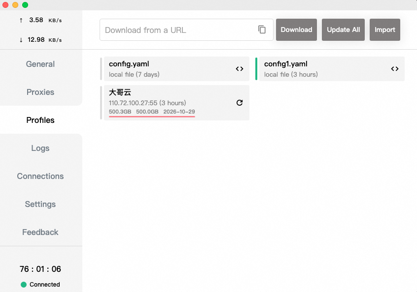

翻墙需要完成以下三个步骤，如下图所示左上角有流量后，就证明翻墙成功啦！

> 第一步：下载安装[Clash for Windows](https://clashforwindows.org/clash-for-windows-download/)；

> 第二步：购买服务[Just My Socks](https://justmysocks3.net/members/index.php)；

> 第三步：配置Clash，开启翻墙；

> 翻墙工具：
> [v2rayU](https://github.com/yanue/V2rayU/tree/master)、vmess、shadowsocks

> 参考文档：
> 1、[Clash for Windows官网](https://clashforwindows.org/)
> 2、[Clash for Windows 代理工具使用说明](https://docs.gtk.pw/contents/quickstart.html)

> 问题记录：
> 1、Clash for Windows在Mac M3电脑Service Proxy开关打开报错Failed to install service；
> [修复参考：](https://clashforwindows.cc/%E5%B8%B8%E8%A7%81%E9%97%AE%E9%A2%98/)
> 因为安装arm版本失败，又重新安装64位版本，但下图中sh脚本的执行找不到文件，需要手动去双击运行clash-core-service，文件放在/Applications/Clash for Windows.app/Contents/Resources/static/files/darwin/x64/service中，然后再去打开Clash的System Proxy的开关就成功了。
> 
