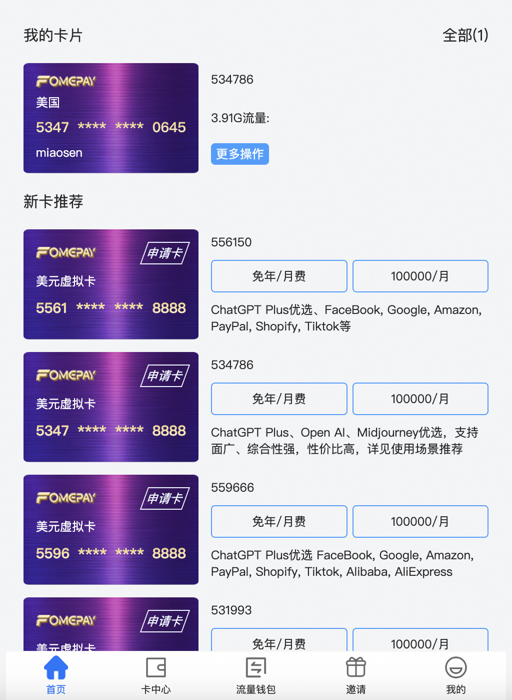

目前国外支付的渠道可以通过以下三种：

> 第一种：支付宝、微信；

> 第二种：Master、Visa卡，这种直接在对应银行app上就可以申请，非常方便；

> 第三种：虚拟信用卡，像OpenAI等对Master卡也不支持的，推荐可以使用[fomepay](https://gpt.fomepay.com/#/pages/cards/index)。购买成功后，点击”更多操作“按钮，可以获取CVC密码以及地址信息。

