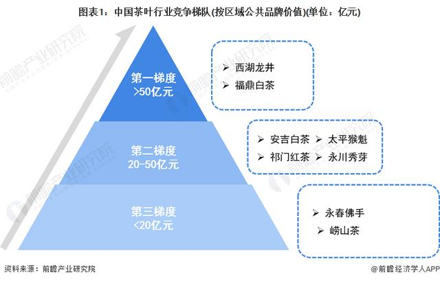
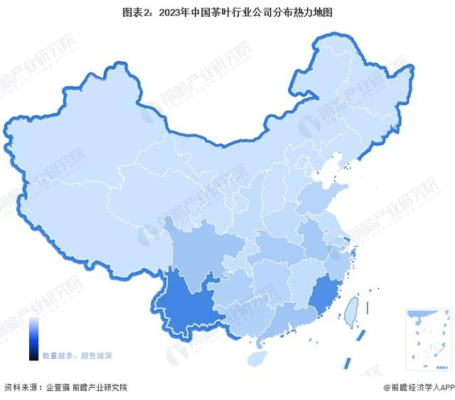
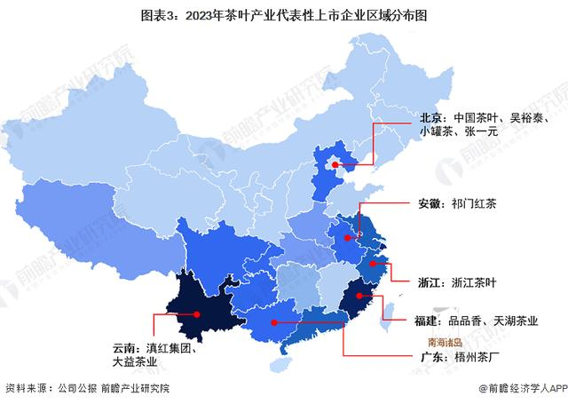
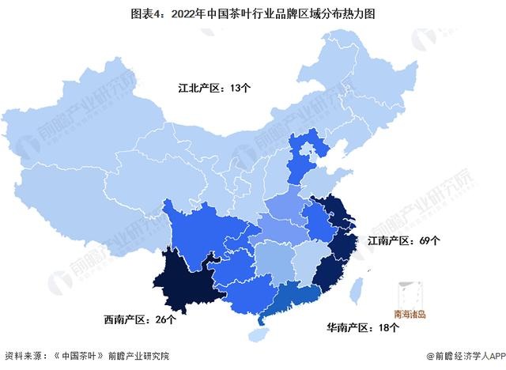
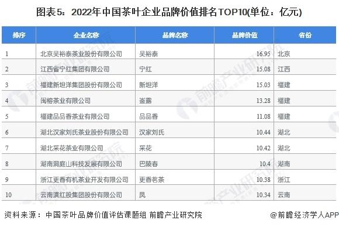
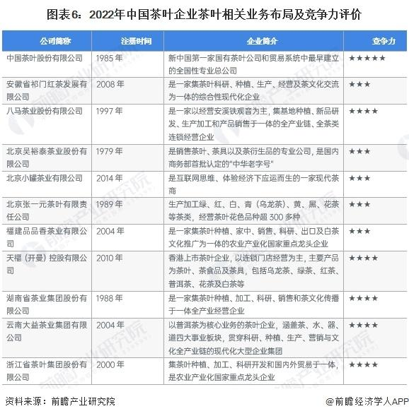
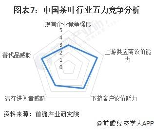

**中国茶叶行业竞争梯队**

依据茶叶区域公共品牌价值对中国茶叶行业竞争梯队进行分析，当前价值大于50亿元的中国茶叶区域公共品牌包括西湖龙井、福鼎白茶等，位于行业竞争第一梯队;20-50亿元区间内品牌包括安吉白茶、太平猴魁等，位于第二梯队;小于20亿元品牌包括永春佛手、崂山茶等，位于第三梯队。

根据企查猫以“精制茶加工业”为选定行业，以“茶叶”为关键词进行精确搜索，得到茶叶企业区域分布。中国茶叶行业企业主要分布在云南(11795家)、福建(10530家)、广东(3784家)、四川(3636家)、安徽(3231家)，其余省份企业不足3000家。

代表企业分布与产茶地相关性较小，现阶段代表企业分布最为密集省市为北京，该市拥有中国茶叶、吴裕泰、小罐茶、张一元等多家知名茶叶企业。

**中国茶叶品牌区域竞争情况**

2022年中国茶叶区域公有品牌分布于四大产茶区，其中江南产区分布最为密集，数量达到69个;西南产区数量达到26个，位列第二;华南、江北产区分列第三、四位，分别达到18个、13个。

**中国茶叶企业品牌价值排名**

根据中国茶叶品牌价值评估课题组发布的报告，目前吴裕泰、宁红、新坦洋、崟露、品品香、汉家刘氏、采花、巴陵春、更香茗茶、凤等品牌位列中国茶叶企业品牌价值前十，其中吴裕泰、宁红、新坦洋三大品牌位列前三名，品牌价值分别达到16.95亿元、15.08亿元、15.03亿元。

**中国茶叶行业企业布局及竞争力评价**

由于中国茶叶市场格局分散，业内代表企业市场份额占比小，除天福茗茶成功于港交所上市外，业内尚未出现上市企业。故文章汇总代表企业茶叶业务发展概况，结合企业注册资本、经营市场等指标对其竞争力进行评价如下：

**中国茶叶行业竞争状态总结**

从五力竞争模型角度分析，目前，茶叶属于传统行业，受新兴替代品威胁较大;现有竞争者数量多，竞争风险高;现阶段茶叶市场供过于求，且行业上游一体化能力较强，故对上游供应商议价能力较强;同时，因行业准入资质以及资金、技术门槛一般，但盈利前景也较弱，故行业吸引力一般，潜在进入者威胁较小。

根据以上分析，对各方面的竞争情况进行量化，5代表最大(竞争激烈/威胁大/议价能力强)，0代表最小(竞争小/威胁小/议价能力弱)，茶叶产业的竞争情况如下图所示。

